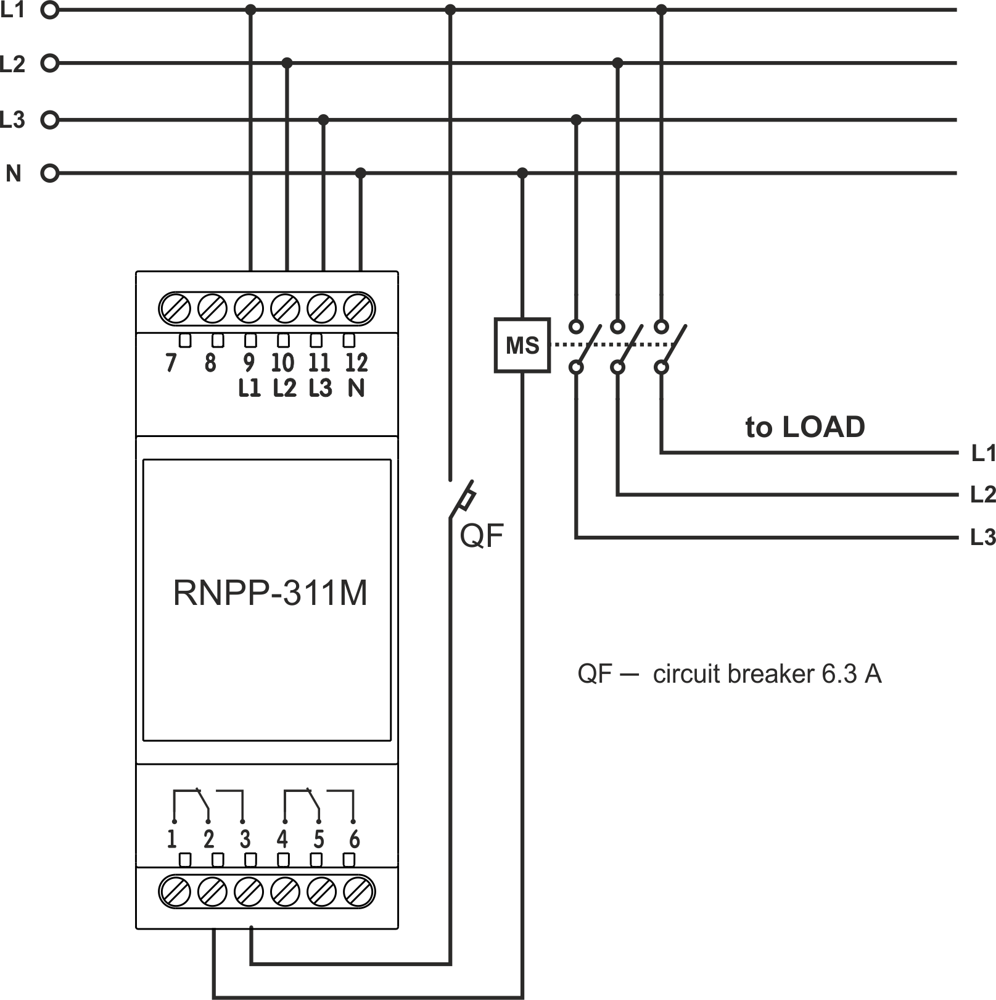

# RNPP-311M MULTIFUNCTIONAL THREE PHASE VOLTAGE MONITORING RELAY. OPERATING MANUAL.

Quality control system on the development and production complies with requirements ISO 9001:2015

---

**Dear customer!**

Company NOVATEK-ELECTRO Ltd. thanks you for purchasing our products. You will be able to use properly the product after carefully studying the Operating Manual. Keep the Operating Manual throughout the service life of the product. Review the Operating manual before using the unit. This unit is safe for use in case of compliance with operating rules.

---

**ATTENTION!** ALL REQUIREMENTS OF THIS OPERATING MANUAL ARE COMPULSORY TO BE MET!

:warning: **WARNING** – PRODUCT TERMINALS AND INTERNAL COMPONENTS ARE UNDER POTENTIALLY LETHAL VOLTAGE TO ENSURE THE PRODUCT SAFE OPERATION **IT IS STRICTLY FORBIDDEN THE FOLLOWING:**

-**TO CARRY OUT MOUNTING WORKS AND MAINTENANCE WITHOUT DISCONNECTING THE PRODUCT FROM THE MAINS;**

- TO OPEN AND REPAIR THE PRODUCT INDEPENDENTLY;
- TO OPERATE THE PRODUCT WITH MECHANICAL DAMAGES OF THE CASE.

IT IS NOT ALLOWED WATER PENETRATION ON TERMINALS AND INTERNAL ELEMENTS OF THE PRODUCT.

During operation and maintenance the regulatory document requirements must be met, namely:

- Regulations for Operation of Consumer Electrical Installations;
- Safety Rules for Operation of Consumer Electrical Installations;
- Occupational Safety when in Operation of Electrical Installations.

**ATTENTION! THE DEVICE IS NOT INTENDED TO BE USED FOR LOAD COMMUTATION IN CASE OF SHORT CIRCUITS. THEREFORE OUTPUT CONTACTS OF LOAD RELAY SHOULD BE PROTECTED BY AUTOMATIC CIRCUIT BREAKERS (FUSES) WITH TRIPPING CURRENT NOT EXCEEDING 6.3 A OF CLASS B.**

**To improve operational properties of the unit it is recommended to install the fuse (fuse element), or the equivalent for current of 1A in power supply circuit (L1, L2, L3) for RNPP-311M.**

Installation, adjustment and maintenance of the product must be performed by qualified personnel having studied this Operating Manual.

**In compliance with the requirements of this Operating Manual and regulations the product is safe for use.**

---

**Figure 1** - Control descriptions and dimensions diagram

1. Input terminals 400 V / 415 V;
2. Switch of voltage of controlled mains **(400 V / 415 V)**;
3. Switch of protection operation at phase sequence **(SEQ)** (in position “OFF” – the protection is disabled);
4. Switch of protection operation at voltage imbalance **(IMB)** (in position “OFF” – the protection is disabled);
5. Switch of protection operation at the minimum voltage **(Umin)** (in position “OFF” – the protection is disabled);
6. Switch of protection operation at the maximum voltage **(Umax)** (in position “OFF” – the protection is disabled);
7. Green LED indicators of voltage presence on each phase **(LINE)**;
8. Red LED **(ALARM)** indicator showing also the open state of the output contacts;
9. Output terminals;
10. Control of setting the protection operation time **(Тoff(sec))**;
11. Control of setting the AR time **(Ton(sec))**;
12. Control of setting the threshold for maximum / minimum voltage **(Unom±%)**.

This operation manual is intended for description, principle of work, construction, mode of work and maintenance of the multifunctional three phase voltage monitoring relay (hereinafter RNPP-311M).

The product meets the requirements of the following:

- EN 60947-1;
- EN 60947-6-2;
- EN 55011;
- EN 61000-4-2.

_Harmful substances, in more than allowed concentration, are not available._

**Terms and abbreviations:**

- **AR** is automatic reclosing;
- **MS** is magnetic starter;

The term **"Normal voltage"** means that the voltage value does not exceed the threshold limit values set by the User.

## 1 APPLICATION

**1.1 RNPP-311M is designed:**

- for monitoring the permissible voltage level;
- for monitoring the correct alternation and absence of sticking of phases;
- for monitoring the full-phase and symmetry of the mains voltage (phase imbalance);
- to disconnect the load in case of improper mains voltage;
- for monitoring the quality of the mains voltage after switching off the load and automatically turning it on after restoring the voltage parameters;
- to indicate the failure in the event of emergency situation and the presence of voltage in each phase.

RNPP-311M performs zero control, indirectly. The device provides the possibility of adjusting the parameters (voltage threshold, time of automatic reclosing and time delay of protection operation), selection of the voltage of the monitored mains (400 V or 415 V) and a set of protective functions.

After restoring the voltage parameters of the mains, the device enables again the load after the reclosing time.

**Note - For networks with a high level of harmonics, we recommend using the modification of the RNPP-311M-24 device with the connection to self-contained 24 V power supply.**

**1.2 Operation conditions**

The product is designed for operation in the following conditions:

- Ambient temperature: from minus 35 to +55°C;
- Atmospheric pressure: from 84 to 106.7 kPa;
- Relative air humidity (at temperature of +25 °C): 30 … 80%.

_If the temperature of the product after transportation or storage differs from the environment temperature at which it is expected to operate, then before connection to electric mains keep the product under the operating conditions within two hours (because the product elements may have moisture condensation)._

**ATTENTION! The product is not intended for operation in the following conditions:**

- Significant vibration and shocks;
- High humidity;
- Aggressive environment with content in the air of acids, alkalis, etc., as well as severe contaminations (grease, oil, dust, etc.).

## 2. TECHNICAL CHARACTERISTICS

**Table 1**

**Table 2**

## 3. INTENDED USE

**3.1 Preparation for operation**
**3.1.1** Preparation for connection:

- Unpack and check the product for damage after transportation; in case of such damages detection, contact the supplier or manufacturer;
- Carefully study the Operating Manual **(pay special attention to the connection diagram to power the product)**;
- If you have any questions regarding the installation of the product, please contact the manufacturer by telephone number indicated at the end of this Operating Manual.

**3.1.2 Device connection**

**ATTENTION! ALL CONNECTIONS MUST BE PERFORMED WHEN THE PRODUCT IS DE-ENERGIZED.**

**Error when performing the installation works may damage the product and connected devices.**

To ensure the reliability of electrical connections you should use flexible (stranded) wires with insulation for voltage of no less than 450 V, the ends of which it is necessary to be striped of insulation for 5±0.5 mm and tightened with bootlaces. Recommended cable cross section for connection is not less 1 mm².

Wires fastening should exclude mechanical damage, twisting and abrasion of the wire insulation.

**IT IS NOT ALLOWED TO LEAVE EXPOSED PORTIONS OF WIRE PROTRUDING BEYOND THE TERMINAL BLOCK.**

**For a reliable contact, tighten the terminal screws with the force indicated in Table 1.**

When reducing the tightening torque, the junction point is heated, the terminal block may be melted and wire can burn. If you increase the tightening torque, it is possible to have thread failure of the terminal block screws or the compression of the connected wire.

**3.1.2.1** Connect the device according to the diagram shown in Fig. 2.

**Figure 2** - RNPP-311M Connection diagram

**Notes:**

- If on the first start up RNPP-311M doesn’t allow to turn ON the power load and indicates wrong phase sequence alarm but the user is absolutely sure that the phase sequence is correct – then it is necessary to exchange the wires connected to terminals **10 and 11**.
- If RNPP-311M is being used as a **maximal voltage protection relay** then the break in the magnetic starter coil power circuit should be connected to terminals **1-2 (4-5)** (the reverse logic of switching-on). The switch **Umax** (it. 6, Fig. 1) should be set to ON position (enabled) and the switches **SEQ**, **IMB** and **Umin** should be set to the OFF position (disabled).

**3.1.2.2** Using the **Unom ±%** control (it. 12, Fig. 1), set the required operation threshold for the maximum and minimum voltage as a percentage of the rated supply voltage of the mains.

**Attention! When setting the lower threshold for Umin, the release voltage of the MS must be taken into account.**

**3.1.2.3** Using the Toff (sec) control (it. 10, Fig. 1), set the protection operation time at the maximum voltage and phase imbalance.

**3.1.2.4** Using **Ton(sec)** control (it. 11, Fig. 1) set the reclosing time AR.

**Ton(sec)** is the time of automatic reclosing after the device operation and restoration of the mains voltage parameters; on-time is after the rated voltage supply to the device.

It is recommended to set the reclosing time AR for air conditioners, refrigerators and other compressor equipment at least 180 - 240 seconds.

**ATTENTION! In order not to break or turn the control, please do not use excessive force when performing the setting operations.**

**3.1.2.5** Enable the necessary protections using protection switches (it. 3 – 6, Fig. 1).
**3.1.2.6** Set the type of mains used with switch of rated voltage of **400 V / 415 V** (it. 2, Fig. 1).
**3.1.2.7** Feed the supply voltage to the terminals of the device.

**3.2 Operation**

**3.2.1** It is possible to adjust the RNPP-311M to operate in following modes:

- “Minimum / maximum voltage control";
- “Minimum voltage control";
- “Maximum voltage control";
- "Phases presence control";
- "Control of incorrect phase sequence and presence of phase sticking";
- "Phase imbalance control".

_Notes: - The control of phases presence is maintained in any operating mode; - In all operating modes, except for the “Maximum voltage control” mode, the product is activated when the phases are broken or the voltage drops below 100 V on one or several phases for a fixed time of 0.2 s._

In “Minimum / maximum voltage control" mode, when the voltage value of the mains is exceeded for the thresholds set by the User, the protected equipment will be disconnected from the mains and red **ALARM** LED indicator will turn ON .

In “Minimum voltage control" mode, when the mains voltage drops below the threshold set by the User, the protected equipment is disconnected from the mains and red **ALARM** LED indicator will turn ON.

In “Maximum voltage control" mode, when the mains voltage rises above the threshold set by the User, the protected equipment is disconnected from the mains and red **ALARM** LED indicator will turn ON.

In "Phases presence control" mode, if one phase is broken, when one of the **LINE** LED indicators will turn OFF, the protected equipment is disconnected from the mains. Red **ALARM** LED indicator will turn ON.

In "Control of incorrect phase sequence and presence of phase sticking" mode, if the connection is incorrect or if one of the phases is sticking, one of the **LINE** LED indicators lights up on the front panel of the device, the **ALARM** LED indicator will turn ON and the protected equipment disconnects from the mains.

In "Phase imbalance control" mode, in case of voltage imbalance, two **LINE** LED indicators flash alternately on the front panel of the device, the **ALARM** LED indicator will turn ON and the protected equipment disconnects from the mains.

**3.2.2** The device at the output has two groups of independent output changeover contacts **(1-2-3, 4-5-6)**. If there is no voltage to the device, the contacts **1-2 (4-5)** are closed, and the contacts **2-3 (5-6)** are open.

When the RNPP-311M is operated, the load is disconnected by interrupting the power supply of the MS coil through **2-3 (5-6)** contacts, **except for the "Maximum Voltage Control" mode in which the device is operated with an inverse switching logic.**

**3.2.3** After the power is supplied to the terminals of the device, the indicators **LINE** turn ON. The device goes into the AR delay time mode (set by the **Ton(sec)** control), while the **ALARM** indicator flashes. After the reclosing time has finished, the **ALARM** indicator turns OFF and the device connects the protected equipment to the mains.

In the event of the failure, the reclosing time AR begins immediately after the device disconnects the protected equipment.

**3.2.4** If the device is used in the “Maximum voltage control" mode, at **normal voltage** in the mains, the device contacts **1-2 (4-5)** are closed, and the contacts **2-3 (5-6)** are open. This is done to ensure that the device in the "Maximum voltage control" mode has never operated for reducing the voltage. In this mode, when the device is turned on for the first time, the reclosing time value **(Ton(sec))** is not taken into account.

**ATTENTION! This mode is not recommended for use with loads of such types: motors, compressor, three-phase transformers, etc.**

**3.2.5** The options for the status of indicators LINE and ALARM are shown in Table 3

**NOTE** - The failure is displayed in order of priority:

- Phase failure or voltage drop below 100 V (highest priority);
- Phase sequence;
- Minimum and maximum voltage;
- Phase imbalance.

**3.2.2** **RNPP-311M usage examples**

**a) RNPP-311M in “Minimum voltage control" mode**

- Switch Umin is in ON position.
- Switches Umax, IMB are in OFF position.

If the voltage drops below Umin, the device will operate after the Toff (sec) time set by the User, the red **ALARM** indicator will turn ON, the corresponding **LINE** indicator (-s) will off. If the voltage drops below 100 V, the device will be operated after 0.2 seconds.

**b) RNPP-311M in "Minimum / maximum voltage control" and "Phases presence control" modes**

- Switches **Umin** and **Umax** are in ON position.

RNPP-311M will operate if the voltage rises above the set threshold after the time **Toff (sec)**, and when it decreases - with the fixed delay of 12 seconds (setting the starting voltage slumps), the red **ALARM** indicator will turn ON. If the phase breaks, the device will operate after 0.2 seconds.

**c) Maximal voltage relay**

- Switch **Umax** is in ON position.
- Switches **Umin**, **SEQ**, **IMB** are in OFF position.
- Red **ALARM** indicator is **OFF**.

If high voltage detected RNPP-311M will turn **OFF** the power load with time delay **(Toff (sec) +0,4)** sec and the red **ALARM** indicator will turn **ON**.

**d) Turn ON time delay relay**

- Switches **Umin**, **Umax** are in OFF position.

The protected equipment will be connected after the AR time countdown set by the User with the help of **Ton(sec)** control. In all modes of operation, the switching ON / OFF of protection due to the phase sequence disturbance is carried out by the switch **SEQ**, and the switching ON / OFF due to the phase imbalance protection - by the switch **IMB**. If the phase is broken or the voltage drops below 100 V in one or more phases, the device will operate (turn OFF) the corresponding phase indicator will turn OFF.

If switches **Umin**, **Umax**, **SEQ**, **IMB** are in ON position and the voltage drop is less than Umin, the device will operate with the fixed delay of 12 seconds (setting the starting voltage slumps).

## 4. MAINTENANCE

**4.1 Safety precautions**

:warning: **THE TERMINALS AND THE PRODUCT INTERNAL ELEMENTS CONTAINS POTENTIALLY LETHAL VOLTAGE. DURING MAINTENANCE IT IS NECESSARY TO DISABLE THE PRODUCT AND CONNECTED DEVICES FROM THE MAINS.**

Maintenance of the unit should be performed by persons admitted to the operation and have the appropriate permission.

The recommended frequency of maintenance is **every six months**.

**4.2 Maintenance procedure:**

- check the wires connection reliability, if necessary – clamp with force as specified in Table 2;
- check visually the housing integrity;
- if necessary, wipe with cloth the front panel and the unit housing.

It is not allowed to clean the unit with abrasive materials or organic compounds (alcohol, gasoline, solvents, etc.).

**4.3** If a device malfunction is detected, turn off the power and check the connection correctness. If the problem persists, take the device out of commission and contact the manufacturer.

## 5. SERVICE LIFE AND WARRANTY

Service life – is 10 years. Contact manufacturer upon the expiry of the service life.

Guaranteed storage life – is 3 years.

Warranty period of the unit operation is 5 years from the date of sale.

During the warranty period the Manufacturer is responsible for free repair of the unit, if the Consumer has complied with the requirements of this Operating Manual.

**ATTENTION! IF THE UNIT HAS BEEN OPERATED WITH VIOLATION OF THE REQUIREMENTS OF THIS OPERATION MANUAL, BUYER WILL FORFEIT THE RIGHT TO WARRANTY SERVICE.**

Warranty service is performed at the place of purchase or by the Manufacturer of the product.

Post-warranty service is performed by the Manufacturer at current rates.

Before sending for repair, the unit should be packed in the original or other packaging excluding mechanical damage.

## 6. TRANSPORTATION AND STORAGE

RNPP-311M in the shipping box should be stored indoors at a temperature of -45 to +60 °C and relative humidity of no more than 80% with no vapors available in the air.
