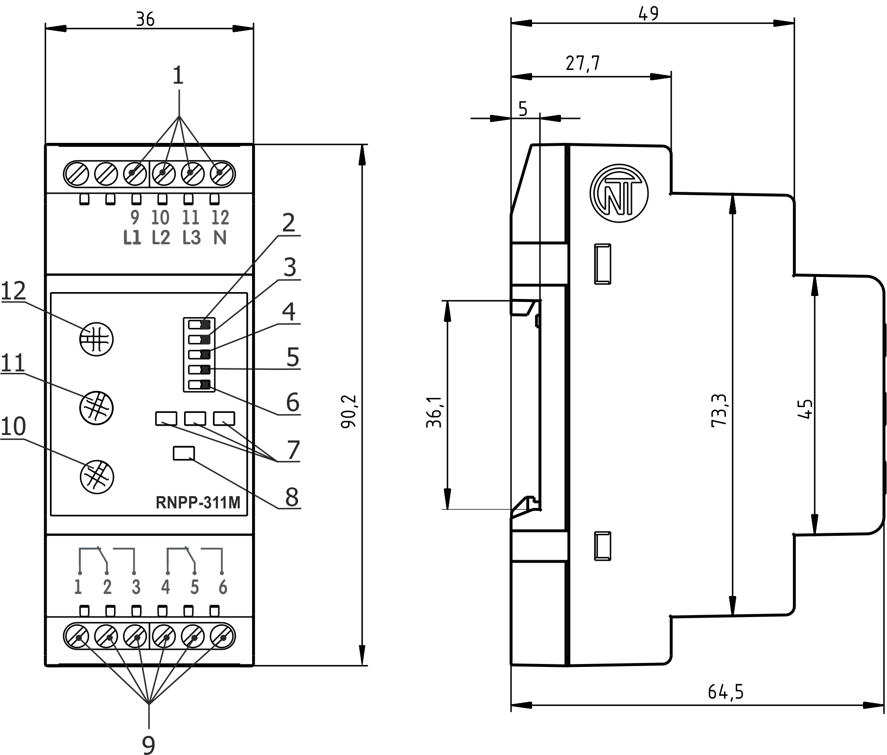

# PRZEKAŹNIK KONTROLI NAPIĘCIA, SYMETRII I KOLEJNOŚCI FAZ RNPP-311M. INSTRUKCJA OBSŁUGI. DOKUMENTACJA TECHNICZNA.

_System zarządzania jakością opracowywania i procesu produkcji spełnia wymagania ISO 9001:2015_

---

**Szanowni Państwo,**

Firma Novatek-Electro dziękuje za zakup naszego produktu. Prosimy o dokładne zapoznanie się z instrukcją, co pozwoli Państwu prawidłowo korzystać z naszego wyrobu. Instrukcję obsługi należy zachować przez cały okres użytkowania urządzenia. Przed przystąpieniem do eksploatacji urządzenia należy dokładnie zapoznać się z Instrukcją obsługi.

---

**UWAGA!! WSZYSTKIE WYMAGANIA OKREŚLONE W NINIEJSZEJ INSTRUKCJI SĄ OBOWIĄZKOWE DO SPEŁNIENIA!**

:warning: **NA ZACISKACH I ELEMENTACH WEWNĘTRZNYCH URZĄDZENIA WYSTĘPUJE NAPIĘCIE NIEBEZPIECZNE DLA ŻYCIA. W CELU ZAPEWNIENIA BEZPIECZNEJ EKSPLOATACJI URZĄDZENIA KATEGORYCZNIE ZABRANIA SIĘ:**

- WYKONYWANIE PRZEGLĄDÓW TECHNICZNYCH I PRAC MONTAŻOWYCH, GDY URZĄDZENIE NIE JEST OD‎ŁĄCZONE OD SIECI;
- SAMODZIELNE OTWIERANIE I NAPRAWA URZĄDZENIA;
- UŻYWANIE URZĄDZENIA Z USZKODZENIAMI MECHANICZNYMI OBUDOWY.

NIEDOPUSZCZALNY JEST KONTAKT ZACISKÓW I ELEMENTÓW WEWNĘTRZNYCH URZĄDZENIA Z WILGOCIĄ.

**URZĄDZENIE NIE JEST PRZEZNACZONE DO PRZEŁĄCZENIA OBCIĄŻENIA W PRZYPADKU ZWARCIA. DLATEGO W OBWODZIE ZASILANIA URZĄDZENIA NALEŻY UŻYĆ WYŁĄCZNIKA NADMIAROWO-PRĄDOWEGO O PRĄDZIE NIE PRZEKRACZAJĄCYM 6.3 A KLASY B.**

**W celu poprawy parametrów eksploatacyjnych urządzenia zalecane jest stosowanie bezpiecznika (wkładki topikowej) lub jego analogu w obwodzie zasilania (L1, L2, L3) RNPP-311M o prądzie 1 A.**

Podczas eksploatacji i obsługi technicznej należy przestrzegać wymagania dokumentów normatywnych:

- “Zasady eksploatacji technicznej użytkowych instalacji elektrycznych”,
- “Zasady BHP podczas eksploatacji użytkowych instalacji elektrycznych”,
- “Higiena pracy podczas eksploatacji instalacji elektrycznych”.

Podłączenie, regulacja i obsługa techniczna urządzenia powinny być wykonywane przez wykwalifikowany personel, który zapoznał się z niniejszą Instrukcją obsługi.

Stosowanie urządzenia jest bezpieczne pod warunkiem przestrzegania zasad eksploatacji.

**Urządzenie spełnia wymagania:**

EN 60947-1; EN 60947-6-2; EN55011; EN 61000-4-2.

Brak szkodliwych substancji w ilościach przekraczających wartości graniczne dopuszczalne stężenia.

**Terminy i skróty:**

- **SPZ** – samoczynne (automatyczne) ponowne załączenie;
- **WE** – wyzwalacz elektromagnetyczny.
- Termin **"Normalne napięcie"** oznacza, że napięcie wejściowe odpowiada wszystkim ustawionym przez użytkownika parametrom.

Niniejsza instrukcja obsługi służy do zapoznania się z budową, zasadą działania, zasadami bezpieczeństwa, eksploatacji i obsługi przekaźnika napięcia, symetrii i kolejności faz RNPP-311M (zwany w dalszej treści «urządzenie», «RNPP-311M»).

## 1 PRZEZNACZENIE

**1.1 Przeznaczenie urządzenia RNPP-311M jest przeznaczony do:**

- kontroli dopuszczalnych wartości napięcia;
- kontroli kolejności faz i ich koincydencji;
- kontroli obecności wszystkich faz i symetrii napięcia sieciowego (asymetrii faz);
- odłączenia obciążenia przy nieprawidłowym napięciu sieciowym;
- kontroli jakości napięcia sieciowego po odłączeniu obciążenia i automatycznego ponownego załączenia po przywróceniu właściwych parametrów napięcia;
- sygnalizacji awarii w razie wystąpienia sytuacji awaryjnej oraz sygnalizacji obecności napięcia w każdej fazie RNPP-311M dokonuje kontroli zera metodą pośrednią.

W urządzeniu przewidziane są możliwości regulacji parametró (progu zadziałania przy zmianie napięcia, czasu SPZ i czasu opóźnienia zadziałania zabezpieczenia). Przekaźnik RNPP-311M umożliwia wybór typu sieci kontrolo-wanej (400 lub 415 V) oraz udostępnia zestaw funkcji ochronnych.

Po przywróceniu parametrów napięcia sieci, urządzenie ponownie włącza obciążenie czasu SPZ.

**Uwaga! W sieciach z wysokim poziomem składowych harmonicznych zalecane jest stosowanie przekaź-nik RNPP-311M-24 z podłączeniem zasilania zewnętrznego 24 V.**

**1.2 Organy sterujące, wymiary gabarytowe i montażowe RNPP-311M**

Elementy sterujące, wymiary gabarytowe i montażowe RNPP-311M są podane na rysunku 1.

**Rysunek 1** - Organy sterujące, wymiary gabarytowe i montażowe

1. wejściowe styki 400/415 V;
2. przełącznik: typ sieci 400/415 V;
3. przełącznik: zadziałanie przy nieprawidłowej kolejności faz i braku ich koincydencji (SEQ) w pozycji «OFF» zabezpieczenie jest wyłączone);
4. przełącznik: zadziałanie przy asymetrii faz (IMB) w pozycji «OFF» zabezpieczenie jest wyłączone);
5. przełącznik: zadziałanie przy Umin, w pozycji «OFF» zabezpieczenie jest wyłączone);
6. przełącznik: zadziałanie przy Umax, w pozycji «OFF» zabezpieczenie jest wyłączone);
7. zielone diody LED obecności napięcia w każdej z faz (LINE);
8. czerwona dioda LED awarii i wyłączenia przekaźnika (ALARM);
9. wyjściowe styki.
10. regulacja opóźnienia zadziałania Toff;
11. regulacja czasu ponownego załączenia Ton;
12. regulacja progu zadziałania przy Umax/Umin Unom;

**1.3 Warunki eksploatacji**

- Temperatura otoczenia od -35 do +55 ºС;
- Ciśnienie atmosferyczne od 84 do 106,7 kPa;
- Względna wilgotność powietrza (przy temperaturze +25 °С) 30…80%.

**UWAGA! Urządzenie nie jest przeznaczone do stosowania w warunkach:**

- występowania wibracji i uderzeń;
- podwyższonej wilgotności;
- środowiska agresywnego z zawartością w powietrzu kwasów, zasad itp. oraz mocnych zabrudzeń (tłuszczu, oleju, kurzu itp.).

## 2 DANE TECHNICZNE

Podstawowe dane techniczne urządzenia są podane w tabeli 1

## 3 ZASTOSOWANIE WEDŁUG PRZEZNACZENIA

**3.1 Przygotowanie do pracy**

**3.1.1 Przygotowanie do podłączenia:**

- sprawdzić, czy urządzenie nie zostało uszkodzone podczas transportu, w przypadku wykrycia jakichkolwiek uszkodzeń należy zwrócić się do dostawcy lub producenta;
- dokładnie zapoznać się z Instrukcją obsługi **(należy zwrócić szczególną uwagę na schemat podłączenia zasilania)**;
- Jeżeli temperatura urządzenia po transporcie lub przechowywaniu różni się od temperatury otoczenia, przy której przewidywana jest praca urządzenia, przed podłączeniem do sieci elektrycznej należy odczekać dwie godziny (na elementach urządzenia może skraplać się wilgoć).

**3.1.2 Podłączenie urządzenia**

**UWAGA! WSZELKIE PODŁĄCZENIA NALEŻY WYKONYWAĆ PRZY ODŁĄCZONYM NAPIĘCIU.**

**Błąd podczas montażu może skutkować uszkodzeniem urządzenia i podłączonych do niego przyrządów.**

Aby zapewnić niezawodność połączeń elektrycznych, zalecane jest stosowanie giętkich przewodów wielodrutowych z izolacją na napięcie nie mniej 450V, końce których przed podłączeniem należy odizolować na 5±0.5 mm i zacisnąć końcówkami tulejkowymi. Zalecamy zastosowanie przewodu o przekroju nie mniejszym niż 1.0 mm2. Przewody muszą być zamocowane w taki sposób, aby nie zostały one narażone na uszkodzenia mechaniczne, skręcanie oraz przetarcie izolacji.

**NIEDOPUSZCZALNE JEST POZOSTAWIENIE ODIZOLOWANYCH CZĘŚCI PRZEWODÓW WYCHODZĄCYCH POZA GRANICE LISTWY ZACISKOWEJ.**

**Aby zapewnić niezawodny styk, należy dokręcić śruby listwy zaciskowej z zachowaniem odpowiedniego momentu dokręcenia wg tabeli 1.**

Zmniejszenie momentu dokręcania powoduje nagrzanie miejsca styku, topienie listwy zaciskowej i zapalenie się przewodu. W przypadku zwiększenia momentu dokręcania może dojść do zerwania gwintu śrub listwy zaciskowej lub uciskania podłączonego przewodu.

3.1.2.1 Podłączyć urządzenie zgodnie z rysunkiem 2.

3.1.2.2 Za pomocą regulatora **Unom±%** (poz.12 rys. 1) ustawić potrzebne wartości progów zadziałania dla maksymalnego i minimalnego napięcia w procentach od znamionowego napięcia sieci.

**Uwaga! Podczas ustawienia dolnego progu dla Umin należy uwzględnić napięcie wyzwalania WE.**

3.1.2.3 Za pomocą regulatora **Toff (sec)** (poz.10 rys. 1) ustawić czas zadziałania zabezpieczenia dla maksymal-nego napięcia i asymetrii faz.

3.1.2.4 Za pomocą regulatora **Ton (sec)** (poz.11 rys. 1) ustawić czas SPZ.

Тon - czas automatycznego ponownego załączenia przekaźnika i przywrócenia parametrów napięcia sieciowego; czas załączenia po podaniu na przekaźnik normalnego napięcia.

Dla klimatyzatorów, lodówek i innych urządzeń wyposażonych w sprężarki zalecane jest ustawienie czasu SPZ na nie mniej niż 180-240 sekund.

**UWAGA! Aby nie uszkodzić pokręteł, prosimy nie używać nadmiernej siły podczas ustawiania parametrów**

3.1.2.5 Za pomocą przełączników zadziałania zabezpieczenia (poz.3 – 6 rys. 1) włączyć potrzebne zabezpieczenia.

3.1.2.6 Za pomocą przełącznika **400 V / 415 V** (poz. 2 rys. 1) ustawić typ używanej sieci.
3.1.2.7 Podać na zaciski urządzenia napięcie zasilające.

**Rysunek 2** - Schemat podłączenia RNPP-311M

**Uwagi:**

_1 - Jeżeli podczas pierwszego włączenia RNPP-311M sygnalizuje nieprawidłową kolejność faz, а użytkownik jest pewny, że kolejność faz jest prawidłowa, należy zamienić miejscami przewody podłączone do zacisków **10** i **11**._

_2 - Jeżeli jest przewidziana praca przekaźnika w trybie "Kontrola maksymalnego napięcia" (pkt. 3.2.1.3), przerwę zasilania cewki wyzwalacza należy podłączyć do zacisków 1-2 (4-5) (odwrotna logika włączenia). Przełącznik **Umax** (poz.6 rys. 1) przełączyć w pozycję “ON”, а przełączniki **SEQ**, **IMB**, **Umin** – w pozycję “OFF”._

**3.2 Praca urządzenia**

**3.2.1 RNPP-311M może pracować w różnych trybach:**

- "Kontrola minimalnego/maksymalnego napięcia";
- "Kontrola minimalnego napięcia";
- "Kontrola maksymalnego napięcia";
- "Kontrola obecności faz";
- "Kontrola nieprawidłowej kolejności i wystąpienia załączenia dwóch faz jednocześnie";
- "Kontrola asymetrii faz";

**_Uwaga:_**

1. Kontrola obecności faz utrzymuje się we wszystkich trybach pracy;
2. Bez względu na tryb pracy przekaźnik zadziała w przypadku zaniku fazy lub spadku napięcia poniżej 100 V na jednej lub kilku fazach po upływie czasu stałego opóźnienia 0.2 s.

3.2.1.1 W trybie "Kontrola minimalnego/maksymalnego napięcia", jeżeli wartość napięcia przekroczy ustawione przez użytkownika progi, chronione urządzenie zostanie odłączone od sieci, a na panelu przednim zaświeci się lampka **ALARM**.

3.2.1.2 W trybie "Kontrola minimalnego napięcia", jeżeli napięcie sieciowe spadnie poniżej progu ustawionego przez użytkownika, chronione urządzenie zostanie odłączone od sieci, a na panelu przednim zaświeci się lampka **ALARM**.

3.2.1.3 W trybie "Kontrola maksymalnego napięcia", jeżeli napięcie sieciowe wzrośnie powyżej progu usta-wionego przez użytkownika, chronione urządzenie zostanie odłączone od sieci, a na panelu przednim zaświeci się lampka **ALARM**.

3.2.1.4 W trybie "Kontrola obecności faz" w przypadku zaniku jednej z faz jedna z lampek **LINE** zgaśnie, chronione urządzenie zostanie odłączone od sieci, a na panelu przednim zaświeci się lampka **ALARM**.

3.2.1.5 W trybie "Kontrola nieprawidłowej kolejności i wystąpienia załączenia dwóch faz jednocześnie" w przypadku nieprawidłowego podłączenia lub załączenia dwóch faz jednocześnie, na panelu przednim przekaźnika naprzemiennie będę świecić jedna z lampek **LINE**, zaświeci się lampka **ALARM**, a chronione urządzenie zostanie odłączone od sieci.

3.2.1.6 W trybie "Kontrola asymetrii faz" w przypadku asymetrii fazna panelu przednim przekaźnika naprzemiennie będą świecić dwie lampki **LINE**, zaświeci się lampka **ALARM**, a chronione urządzenie zostanie odłączone od sieci.

**3.2.2** Na wyjściu przekaźnik posiada dwa komplety niezależnych styków przełącznych (1-2-3, 4-5-6). W stanie zimnym (przy braku napięcia lub gdy przekaźnik nie jest podłączony) styki 1-2(4-5) są zwarte, a styki 2-3 (5-6) rozwarte.

Gdy przekaźnik obciążenia zadziała, wyłączenie obciążenia następuje w wyniku przerwania obwodu zasilania cewki wyzwalacza elektromagnetycznego poprzez styki 2-3 (5-6), **z wyjątkiem trybu maksymalnego napięcia, w którym przekaźnik pracuje z odwrotną logiką załączenia**.

**3.2.3** Po podaniu zasilania na zaciski urządzenia zostają włączone lampki **LINE**. Przekaźnik przechodzi w tryb opóźnienia czasu SPZ (ustawiany za pomocą pokrętła **Ton(sec)**), wówczas miga lampka **ALARM**.

Po zakończeniu odliczania czasu SPZ lampka **ALARM** zostanie wyłączona i przekaźnik podłączy chronione urządzenie do sieci.

W przypadku wystąpienia awarii odliczanie czasu SPZ zaczyna się od razu po zadziałaniu przekaźnika obciążenia.

**3.2.4** Jeżeli przekaźnik jest używany w trybie "Kontrola maksymalnego napięcia", przy **normalnym napięciu** w sieci przekaźnik obciążenia jest wyłączony (styki 1-2 (4-5) zwarte, а styki 2-3 (5-6) rozwarte). Zrobiono tak, żeby urządzenie w trybie "Kontrola maksymalnego napięcia" nigdy nie zadziałał w przypadku spadku napięcia. W tym trybie podczas pierwszego włączenia przekaźnika do sieci wartość czasu SPZ (**Ton(sec)**) nie jest uwzgledniana.

**UWAGA! Zaleca się nie używać ten tryb do obciążenia typu: silnik, sprężarka, przekładniki trójfazowe itp.**

**3.2.5** W tabeli 2 podane są warianty stanu diod LED **LOAD** i **ALARM**.

**Tabela 2**

**UWAGA:** Alarmy wyświetlane są w kolejności ich priorytetów:

- zanik faz lub spadek napięcia poniżej 100 V (najwyższy priorytet);
- nieprawidłowa kolejność faz;
- minimalne i maksymalne napięcie;
- asymetria faz.

**3.3. Przykłady zastosowania przekaźnika RNPP-311М.**

**3.3.1 Przekaźnik kontroli napięcia minimalnego**

Przełącznik **Umin** znajduje się w pozycji "ON".

Przełączniki **Umax**, **IMB** znajdują się w pozycji "OFF".

Jeżeli awaria nastąpiła na skutek napięcia minimalnego, przekaźnik zadziała po upływie ustawionego przez użytkownika czasu **Toff**, zaświeci się dioda **ALARM** i zgaśnie odpowiednia dioda (lub diody) **LINE**.

W przypadku spadku napięcia poniżej 100 V przekaźnik zadziała po upływie 0.2 s.

**3.3.2 Przekaźnik kontroli minimalnego/maksymalnego napięcia i obecności faz.**

Przełączniki **Umax** i **Umin** znajdują się w pozycji "ON".

Przekaźnik zadziała w przypadku wzrostu napięcia powyżej ustawionego progu po upływie czasu **Toff**, a w przypadku spadku – po upływie stałego opóźnienia 12 s (czas nieczułości na napięcie rozruchu).

Zaświeci się czerwona dioda LED **ALARM**. W przypadku zaniku faz przekaźnik zadziała po upływie 0.2 s.

**3.3.3 Przekaźnik kontroli napięcia maksymalnego**

Przełącznik **Umax** znajduje się w pozycji "ON".

Przełączniki **Umin**, **SEQ** i **IMB** w pozycji "OFF”. Zgaśnie się dioda LED **ALARM**.

Jeżeli awaria nastąpiła na skutek napięcia maksymalnego, przekaźnik zadziała po upływie czasu (**Toff**+0.4) s, czerwona dioda LED **ALARM** świeci.

**3.3.4 Przekaźnik czasowy z opóźnieniem załączenia**

Przełączniki **Umin**, **Umax** znajdują się w pozycji "OFF”.

Przekaźnik obciążenia włączy się po odliczaniu czasu, ustawionego przez użytkownika pokrętłem **Ton**.

We wszystkich trybach pracy włączenie/wyłączenie zabezpieczenia przed nieprawidłową kolejnością faz odbywa się za pomocą przełącznika **SEQ**, natomiast włączenie/wyłączenie zabezpieczenia przed asymetrią faz odbywa się za pomocą przełącznika IMB.

W przypadku zaniku faz lub spadku napięcia poniżej 100 V na jednej lub więcej fazach przekaźnik zadziała (włączy się), dioda LED odpowiedniej fazy zgaśnie.

Jeżeli przełączniki **Umin**, **Umax**, **SEQ** i **IMB** znajdują się w pozycji "ON", a awaria nastąpiła na skutek napięcia minimalnego, przekaźnik zadziała po upływie stałego opóźnienia 12 s (czas nieczułości na napięcie rozruchu).

## 4 OBSŁUGA TECHNICZNA

**4.1 Zasady bezpieczeństwa**

:warning:**NA ZACISKACH I ELEMENTACH WEWNĘTRZNYCH URZĄDZENIA WYSTĘPUJE NAPIĘCIE NIEBEZPIECZNE DLA ŻYCIA. PODCZAS OBSŁUGI TECHNICZNEJ URZĄDZENIE I PODŁĄCZONY DO NIEGO SPRZĘT NALEŻY ODŁĄCZYĆ OD SIECI ZASILAJĄCEJ.**

**4.2** Obsługa techniczna urządzenia powinna być wykonywana przez wykwalifikowany personel.

**4.3** Zalecana częstotliwość przeglądów technicznych: **co 6 miesięcy**.

**4.4** Zakres czynności obsługi technicznej:

- sprawdzić niezawodność podłączeń przewodów, ewentualnie dokręcić odpowiednim momentem wg tabeli 1;
- wizualnie sprawdzić, czy obudowa jest nienaruszona; w przypadku wykrycia wyszczerbień i pęknięć zaprzestać używania urządzenia i oddać do naprawy;
- ewentualnie przetrzeć szmatką panel przedni i obudowę urządzenia.

**Do czyszczenia urządzenia nie używać materiałów ściernych i rozpuszczalników.**

**4.5** W przypadku wadliwego funkcjonowania urządzenia, neleży wyłączyć zasilanie oraz sprawdzić podłączenie.

W przypadku gdy nie udalo się zidentyfikować potencjalne przyczyny awarii, prosimy skontaktować się z producentem.

## 5 TRANSPORT I PRZECHOWYWANIE

Przekaźnik powinien być przechowywany w oryginalnym opakowaniu w zamkniętym pomieszczeniu, gdzie temperatura wynosi od -45 do +60°С, wilgotność względna nie przekracza 80%.

## 6 OKRES EKSPLOATACJI I GWARANCJA

**6.1** Czas eksploatacji urządzenia wynosi 10 lat. Po upływie czasu eksploatacji należy zwrócić się do producentaw sprawie możliwości dalszej eksploatacji urządzenia.

**6.2** Okres przechowywania wynosi 3 lata.

**6.3** Okres gwarancji na urządzenie wynosi 5 lat od daty sprzedaży.

W czasie trwania gwarancji (w przypadku nie zadziałania urządzenia) producent zapewnia bezpłatną naprawę urządzenia.

**UWAGA!! KUPUJĄCY TRACI UPRAWNIENIA Z TYTUŁU GWARANCJI, JEŻELI USZKODZENIE URZĄDZE-NIA WYNIKŁO NA SKUTEK NIEPRZESTRZEGANIA ZASAD ZAWARTYCH W NINIEJSZEJ INSTRUKCJI.**

**6.4** Obsługa gwarancyjna zapewniana jest w miejscu dokonania zakupu lub przez producenta.

**6.5** Producent zapewnia obsługę pogwarancyjną zgodnie z obowiązującym cennikiem.

**6.6** Przed wysłaniem urządzenia do naprawy należy go zapakować w opakowanie fabryczne lub inne opakowanie, które zabezpieczy urządzenie przed uszkodzeniami mechanicznymi.

_Uwaga: W przypadku zwrotu lub przesłania urządzenia do naprawy gwarancyjnej lub pogwarancyjnej w polu informacji o reklamacji należy dokładnie opisać przyczynę zwrotu._

## 7 CERTYFIKAT INSPEKCYJNY

Dział Kontroli Jakości potwierdza, że RNPP-311M został wykonany zgodnie z aktualną dokumentacją techniczną oraz uznany za nadający się do bezpiecznej eksploatacji.
