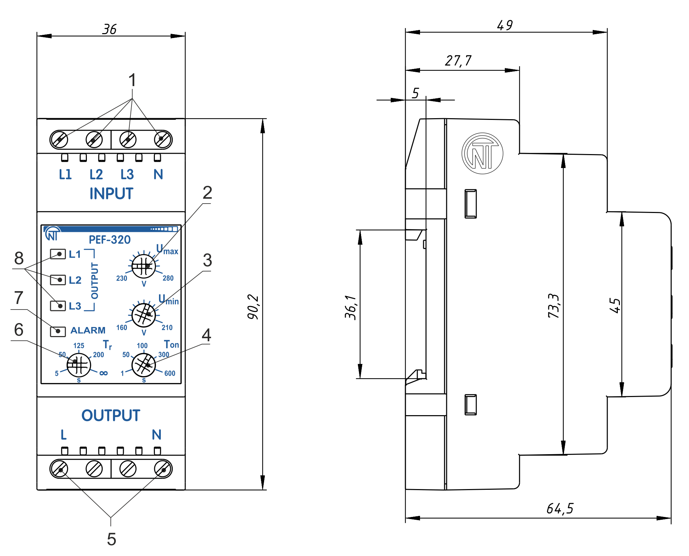
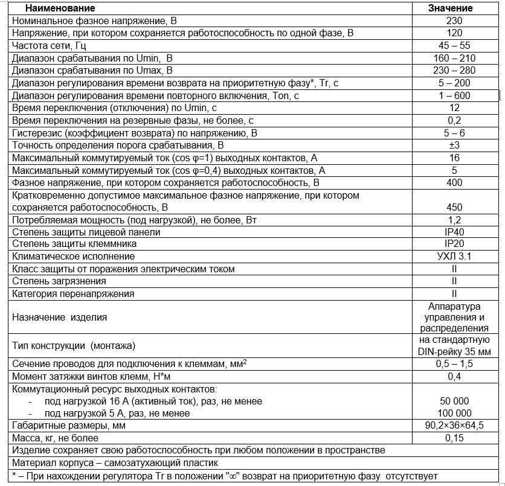
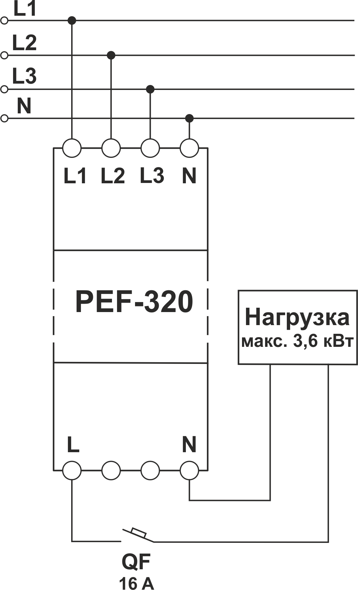

# УНИВЕРСАЛЬНЫЙ АВТОМАТИЧЕСКИЙ ЭЛЕКТРОННЫЙ ПЕРЕКЛЮЧАТЕЛЬ ФАЗ PEF-320. РУКОВОДСТВО ПО ЭКСПЛУАТАЦИИ. ПАСПОРТ

_Система управления качеством разработки и производства изделий соответствует требованиям ISO 9001:2015_

**Уважаемый покупатель!**

**Предприятие "Новатек - Электро" благодарит Вас за приобретение нашей продукции. Внимательно изучив Руководство по эксплуатации, Вы сможете правильно пользоваться изделием. Сохраняйте Руководство по эксплуатации на протяжении всего срока службы изделия.**

**ВНИМАНИЕ! ВСЕ ТРЕБОВАНИЯ РУКОВОДСТВА ПО ЭКСПЛУАТАЦИИ ОБЯЗАТЕЛЬНЫ ДЛЯ ВЫПОЛНЕНИЯ!**

:warning:**ПРЕДОСТЕРЕЖЕНИЕ** – НА КЛЕММАХ И ВНУТРЕННИХ ЭЛЕМЕНТАХ ИЗДЕЛИЯ ПРИСУТСТВУЕТ ОПАСНОЕ ДЛЯ ЖИЗНИ НАПРЯЖЕНИЕ. ДЛЯ ОБЕСПЕЧЕНИЯ БЕЗОПАСНОЙ ЭКСПЛУАТАЦИИ ИЗДЕЛИЯ **КАТЕГОРИЧЕСКИ ЗАПРЕЩАЕТСЯ:**

- ВЫПОЛНЯТЬ МОНТАЖНЫЕ РАБОТЫ И ТЕХНИЧЕСКОЕ ОБСЛУЖИВАНИЕ **БЕЗ ОТКЛЮЧЕНИЯ ИЗДЕЛИЯ ОТ ПИТАЮЩЕЙ СЕТИ**;
- САМОСТОЯТЕЛЬНО ОТКРЫВАТЬ И РЕМОНТИРОВАТЬ ИЗДЕЛИЕ;
- ЭКСПЛУАТИРОВАТЬ ИЗДЕЛИЕ С МЕХАНИЧЕСКИМИ ПОВРЕЖДЕНИЯМИ КОРПУСА.

НЕ ДОПУСКАЕТСЯ ПОПАДАНИЕ ВОДЫ НА КЛЕММЫ И ВНУТРЕННИЕ ЭЛЕМЕНТЫ ИЗДЕЛИЯ.

При эксплуатации и техническом обслуживании необходимо соблюдать требования нормативных документов:

- «Правила технической эксплуатации электроустановок потребителей»,
- «Правила техники безопасности при эксплуатации электроустановок потребителей»,
- «Охрана труда при эксплуатации электроустановок».

Подключение, регулировка и техническое обслуживание изделия должны выполняться квалифицированными специалистами, изучившими настоящее Руководство по эксплуатации. При соблюдении правил эксплуатации изделие безопасно для использования. Настоящее Руководство по эксплуатации предназначено для ознакомления с устройством, требованиями по безопасности, порядком эксплуатации и обслуживания автоматического электронного переключателя фаз PEF-320 (далее по тексту изделие, PEF-320).

**_Изделие соответствует требованиям:_**

- ДСТУ EN 60947-1:2017 Пристрої комплектні розподільчі низьковольтні. Частина 1. Загальні правила;
- ДСТУ EN 60947-6-2:2014 Перемикач і контролер низьковольтні. Частина 6-2. Устаткування багатофункційне. Пристрої перемикання керувальні та захисні;
- ДСТУ EN 55011:2017 Електромагнітна сумісність. Обладнання промислове, наукове та медичне радіочастотне. Характеристики електромагнітних завад. Норми і методи вимірювання;
- ДСТУ EN 61000-4-2:2018 Електромагнітна сумісність. Частина 4-2. Методи випробування та вимірювання. Випробування на несприйнятливість до електростатичних розрядів.

Вредные вещества в количестве, превышающем предельно допустимые концентрации, отсутствуют.

**Термины и сокращения:**

- **АПВ** – автоматическое повторное включение;
- **OUTPUT** – клеммы для подключения нагрузки, а также индикаторы, указывающие на подключенную к нагрузке фазу **(L1, L2, L3)**.
- Термин **«Нормальное напряжение»** означает, что значение напряжения не выходит за пределы порогов, установленных Пользователем.

---

## 1 НАЗНАЧЕНИЕ

**1.1 Назначение изделия**
Универсальный автоматический электронный переключатель фаз PEF-320 предназначен для питания промышленной и бытовой однофазной нагрузки 230 В 50 Гц от трехфазной четырехпроводной сети (3х400+N) с целью обеспечения питания особо ответственных однофазных потребителей и защиты их от недопустимых колебаний напряжения в сети. В зависимости от наличия и качества напряжения на фазах PEF-320 автоматически производит выбор ближайшей по приоритету фазы в пределах установок, заданных Пользователем, и подключает к ней однофазную нагрузку. Возможно подключение к одной из фаз электрогенератора, инвертора. Пороги минимального и максимального напряжения задаются Пользователем.

**1.2 Органы управления, габаритные и установочные размеры PEF-320**

Органы управления и габаритные размеры PEF-320 приведены на рисунке 1

1. клеммы для подключения питания;
2. регулятор установки порога срабатывания по максимальному напряжению (Umax);
3. регулятор установки порога срабатывания по минимальному напряжению (Umin);
4. регулятор установки времени автоматического повторного включения (Тon);
5. клеммы для подключения нагрузки;
6. регулятор установки времени возврата на приоритетную фазу (Тr);
7. индикатор аварии (ALARM);
8. индикаторы фаз (L1, L2, L3).

**Рисунок 1** - Органы управления, габаритные и установочные размеры PEF-320

**1.3 Условия эксплуатации**
Изделие предназначено для эксплуатации в следующих условиях:

- температура окружающей среды от минус 35 до +55 ºС;
- атмосферное давление от 84 до 106,7 кПа;
- относительная влажность воздуха (при температуре +25 ºС) 30 … 80%.

_Если температура изделия после транспортирования или хранения отличается от температуры среды, при которой предполагается эксплуатация, то перед подключением к электрической сети выдержать изделие в условиях эксплуатации в течение двух часов (т.к. на элементах изделия возможна конденсация влаги)._

**ВНИМАНИЕ! Изделие не предназначено для эксплуатации в условиях:**

- значительной вибрации и ударов;
- высокой влажности;
- агрессивной среды с содержанием в воздухе кислот, щелочей, и т. п., а также сильных загрязнений (жир, масло, пыль и пр.).

---

## 2 ТЕХНИЧЕСКИЕ ХАРАКТЕРИСТИКИ

Технические характеристики PEF-320 приведены в таблице 1

**Таблица1**

---

## 3 УСТРОЙСТВО И ПРИНЦИП РАБОТЫ

Электронный переключатель фаз PEF-320 – микропроцессорное цифровое устройство. Пользователь выставляет пороги срабатывания PEF-320 – минимальное и максимальное значение напряжения, при котором изделие срабатывает и переключает на резервную фазу (отключает нагрузку). Свечение одного из зеленых светодиодов L1, L2, L3 на лицевой панели указывает фазу, к которой подключена нагрузка.

PEF-320 имеет три независимых ввода, клемма L1 (приоритетная фаза) и L2, L3 (резервные фазы). При нормальном напряжении на всех фазах, (L1, L2, L3) нагрузка будет подключена к фазе L1. Если значение напряжения L1 выходит за пределы порогов срабатывания, PEF-320 подключает нагрузку к фазе L2. Если на L2 значение напряжения выходит за пределы порогов срабатывания, PEF-320 подключает нагрузку к фазе L3. Если напряжение на резервных фазах не соответствует выставленным порогам – нагрузка отключается. **Переключение на фазу с недопустимыми параметрами не производится.** После перехода на резервную фазу и восстановления параметров напряжения на приоритетной, нагрузка переключится на приоритетную фазу через время возврата, заданное Пользователем.

**ВНИМАНИЕ! Если при отсчете времени возврата напряжение на приоритетной фазе выйдет за пределы порогов, то счетчик времени перезапустится.**

Если регулятор времени возврата на приоритетную фазу Тr установлен в положении “∞”, то возврат на приоритетную фазу происходит только при выходе напряжения на резервной фазе за пределы заданных порогов. В том случае, когда напряжение, подаваемое на нагрузку, снизится ниже порога минимально допустимого напряжения, переключение или отключение нагрузки происходит с временной задержкой 12 секунд. Если значение напряжения превысит порог максимально допустимого напряжения или же снизится на 30 В ниже порога минимально допустимого напряжения - переключение или отключение нагрузки произойдет с задержкой 0,2 секунды. При отключении нагрузки PEF-320 продолжает контроль напряжения на всех фазах. После восстановления параметров напряжения на одной из фаз, PEF-320 подключит нагрузку к этой фазе по окончании отсчета времени АПВ.

---

## 4 ИСПОЛЬЗОВАНИЕ ПО НАЗНАЧЕНИЮ

**4.1 Подготовка к использованию**  
**4.1.1** Подготовка к подключению:

1. распаковать и проверить изделие на отсутствие повреждений после транспортировки, в случае обнаружения таковых обратиться к поставщику или производителю;
2. внимательно изучить Руководство по эксплуатации (**обратите особое внимание на схему подключения питания изделия**);
3. если у Вас возникли вопросы по монтажу изделия, пожалуйста, обратитесь к производителю.

**4.1.2** Подключение изделия

**ВНИМАНИЕ! ИЗДЕЛИЕ НЕ ПРЕДНАЗНАЧЕНО ДЛЯ КОММУТАЦИИ НАГРУЗКИ ПРИ КОРОТКИХ ЗАМЫКАНИЯХ. В ЦЕПИ ВЫХОДНЫХ КОНТАКТОВ ИЗДЕЛИЯ НЕОБХОДИМО УСТАНОВИТЬ АВТОМАТИЧЕСКИЙ ВЫКЛЮЧАТЕЛЬ (ПРЕДОХРАНИТЕЛЬ) С ТОКОМ ОТКЛЮЧЕНИЯ НЕ БОЛЕЕ 16 А КЛАССА B.**

**ВНИМАНИЕ! Все подключения должны выполняться при обесточенном изделии.**

**Ошибка при выполнении монтажных работ может вывести из строя изделие и подключенные к нему приборы.**

Для обеспечения надежности электрических соединений следует использовать гибкие (многопроволочные) провода с изоляцией на напряжение не менее 450 В, концы которых необходимо зачистить от изоляции на 5±0,5 мм и обжать втулочными наконечниками. Рекомендуется использовать провод сечением не менее 1 мм2. Крепление проводов должно исключать механические повреждения, скручивание и стирание изоляции проводов.

**НЕ ДОПУСКАЕТСЯ ОСТАВЛЯТЬ ОГОЛЕННЫЕ УЧАСТКИ ПРОВОДА, ВЫСТУПАЮЩИЕ ЗА ПРЕДЕЛЫ КЛЕММНИКА.**

**Для надежного контакта необходимо производить затяжку винтов клеммника с усилием, указанным в таблице 1.**

При уменьшении момента затяжки – место соединения нагревается, может оплавиться клеммник и загореться провод. При увеличении момента затяжки – возможен срыв резьбы винтов клеммника или пережимание подсоединенного провода.

**4.1.2.1** Подключить изделие согласно рисунку 2.

**Рисунок 2** – Схема подключения PEF-320

**QF** - автоматический выключатель на ток не более 16 А.

**4.1.2.2** Установить параметры работы изделия с помощью регуляторов: Umax, Umin, Тr и Тon.

**ВНИМАНИЕ! Не прилагайте чрезмерных усилий при выполнении установочных операций.**

**Umax** – порог срабатывания по максимальному напряжению.

**Umin** – порог срабатывания по минимальному напряжению.

**Тon** – время автоматического повторного включения нагрузки после восстановления параметров напряжения на одной из фаз, а также время первоначального включения нагрузки при подаче напряжения на PEF-320.
Для холодильников, кондиционеров и других компрессорных приборов **Тon** рекомендуется выставлять в пределах 180 – 600 с, для других приборов – согласно их инструкциям по эксплуатации.

**Тr** – время возврата на приоритетную фазу.

После выставления пороговых значений изделие готово к работе с нагрузкой.

**Допускается изменять значения Umax, Umin, Тr и Тon во время работы изделия с соблюдением правил техники безопасности.**

**4.2 Использование по назначению**
После подключения к сети и установки параметров PEF-320 готов к работе. Свечение одного из индикаторов **L1**, **L2**, **L3** на лицевой панели указывают фазу, к которой подключена нагрузка. Если произойдет отключение нагрузки от всех трех фаз, горит индикатор **ALARM**. Если напряжение на всех трех фазах не соответствует выставленным порогам срабатывания – нагрузка отключается и загорается индикатор **ALARM**. В том случае, когда в сети используется несколько PEF-320, для предотвращения перегрузки по фазам рекомендуется в качестве приоритетной выбирать разные фазы для разных групп потребителей.

---

## 5 ТЕХНИЧЕСКОЕ ОБСЛУЖИВАНИЕ

**5.1 Меры безопасности**

:warning:**НА КЛЕММАХ И ВНУТРЕННИХ ЭЛЕМЕНТАХ ИЗДЕЛИЯ ПРИСУТСТВУЕТ ОПАСНОЕ ДЛЯ ЖИЗНИ НАПРЯЖЕНИЕ. ПРИ ТЕХНИЧЕСКОМ ОБСЛУЖИВАНИИ НЕОБХОДИМО ОТКЛЮЧИТЬ ИЗДЕЛИЕ И ПОДКЛЮЧЕННЫЕ К НЕМУ УСТРОЙСТВА ОТ ПИТАЮЩЕЙ СЕТИ.**

**5.2** Техническое обслуживание изделия должно выполняться квалифицированными специалистами.

**5.3** Рекомендуемая периодичность технического обслуживания – **каждые шесть месяцев**.

**5.4** Порядок технического обслуживания:

1. проверить надежность подсоединения проводов, при необходимости зажать с усилием, указанным в таблице 1;
2. визуально проверить целостность корпуса, в случае обнаружения трещин и сколов изделие снять с эксплуатации и отправить на ремонт;
3. при необходимости протереть ветошью лицевую панель и корпус изделия.
   Для чистки не используйте абразивные материалы и растворители.

---

## 6 СРОК СЛУЖБЫ И ГАРАНТИЯ ИЗГОТОВИТЕЛЯ

**6.1** Срок службы изделия 10 лет. По истечении срока службы обратитесь к производителю.

**6.2** Срок хранения – 3 года.

**6.3** Гарантийный срок эксплуатации изделия составляет 10 лет со дня продажи. В течение гарантийного срока эксплуатации (в случае отказа изделия) производитель выполняет бесплатно ремонт изделия.

**ВНИМАНИЕ! ЕСЛИ ИЗДЕЛИЕ ЭКСПЛУАТИРОВАЛОСЬ С НАРУШЕНИЕМ ТРЕБОВАНИЙ ДАННОГО РУКОВОДСТВА ПО ЭКСПЛУАТАЦИИ, ПОТРЕБИТЕЛЬ ТЕРЯЕТ ПРАВО НА ГАРАНТИЙНОЕ ОБСЛУЖИВАНИЕ.**

**6.4** Гарантийное обслуживание производится по месту приобретения или производителем изделия.

**6.5** Послегарантийное обслуживание изделия выполняется производителем по действующим тарифам.
**6.6** Перед отправкой на ремонт изделие должно быть упаковано в заводскую или другую упаковку, исключающую механические повреждения.

_Убедительная просьба: при возврате изделия или передаче его на гарантийное (послегарантийное) обслуживание, в поле сведений о рекламациях подробно указывать причину возврата._

---

## 7 ТРАНСПОРТИРОВАНИЕ И ХРАНЕНИЕ

Изделие в упаковке производителя допускается транспортировать и хранить при температуре от минус 45 до +60 °C и относительной влажности не более 80%.
