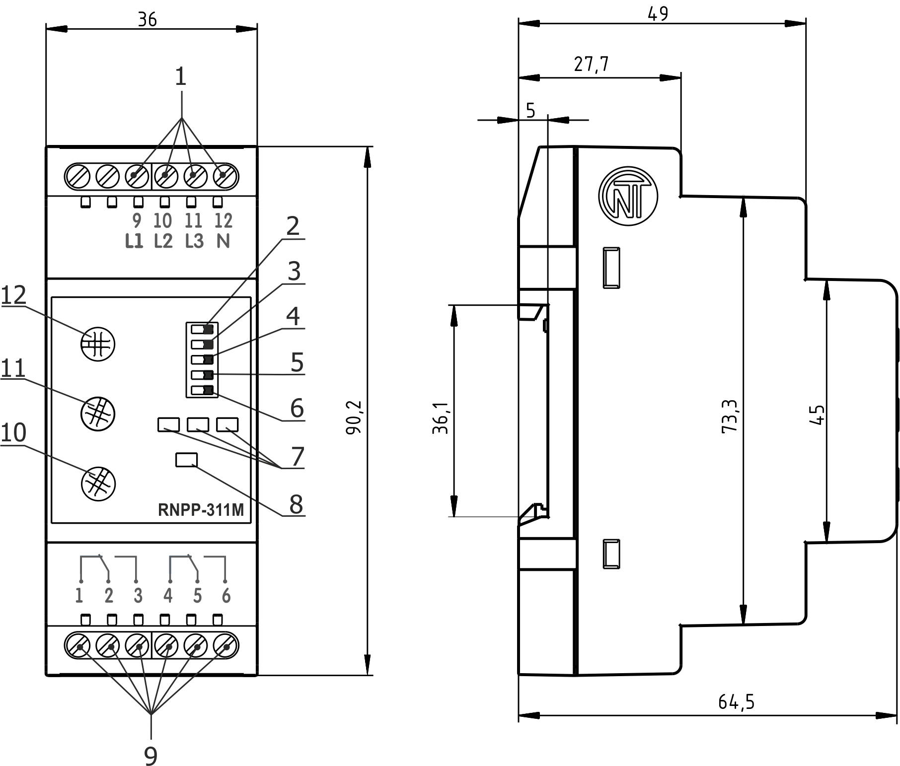
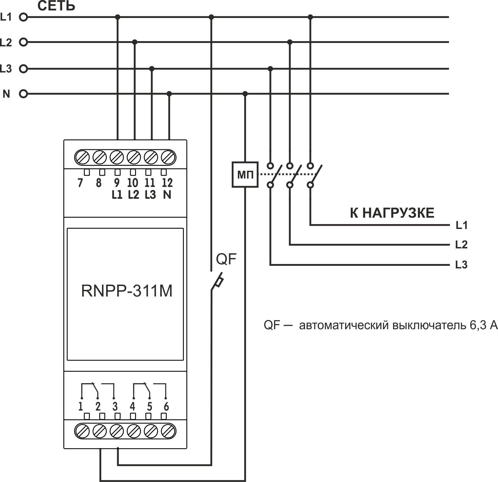
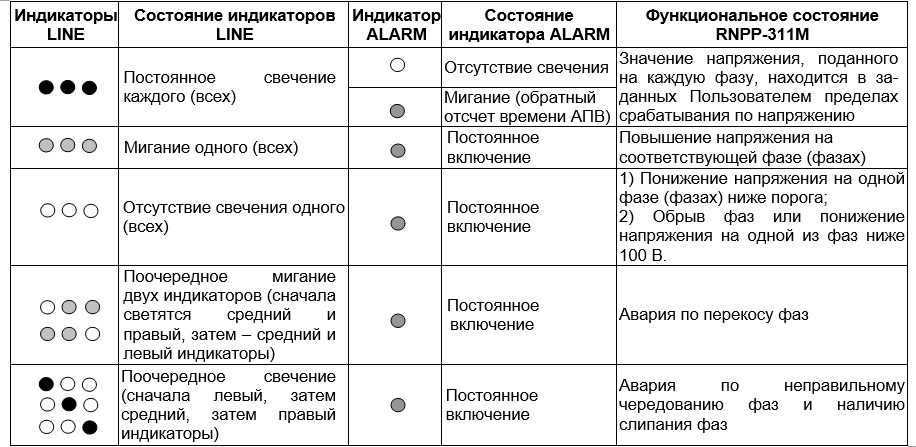

# РЕЛЕ НАПРЯЖЕНИЯ, ПЕРЕКОСА И ПОСЛЕДОВАТЕЛЬНОСТИ ФАЗ RNPP-311M. РУКОВОДСТВО ПО ЭКСПЛУАТАЦИИ. ПАСПОРТ.

Система управления качеством разработки и производства изделий соответствует требованиям ISO 9001:2015

---

**Уважаемый покупатель!**

**Предприятие "Новатек - Электро" благодарит Вас за приобретение нашей продукции. Внимательно изучив Руководство по эксплуатации, Вы сможете правильно пользоваться изделием. Сохраняйте Руководство по эксплуатации на протяжении всего срока службы изделия.**

---

:warning: **ВНИМАНИЕ! ВСЕ ТРЕБОВАНИЯ РУКОВОДСТВА ПО ЭКСПЛУАТАЦИИ ОБЯЗАТЕЛЬНЫ ДЛЯ ВЫПОЛНЕНИЯ!** – НА КЛЕММАХ И ВНУТРЕННИХ ЭЛЕМЕНТАХ ИЗДЕЛИЯ **ПРИСУТСТВУЕТ ОПАСНОЕ ДЛЯ ЖИЗНИ НАПРЯЖЕНИЕ.**

ДЛЯ ОБЕСПЕЧЕНИЯ БЕЗОПАСНОЙ ЭКСПЛУАТАЦИИ ИЗДЕЛИЯ **КАТЕГОРИЧЕСКИ ЗАПРЕЩАЕТСЯ:**

- ВЫПОЛНЯТЬ МОНТАЖНЫЕ РАБОТЫ И ТЕХНИЧЕСКОЕ ОБСЛУЖИВАНИЕ **БЕЗ ОТКЛЮЧЕНИЯ ИЗДЕЛИЯ ОТ ПИТАЮЩЕЙ СЕТИ;**
- САМОСТОЯТЕЛЬНО ОТКРЫВАТЬ И РЕМОНТИРОВАТЬ ИЗДЕЛИЕ;

- ЭКСПЛУАТИРОВАТЬ ИЗДЕЛИЕ С МЕХАНИЧЕСКИМИ ПОВРЕЖДЕНИЯМИ КОРПУСА;

НЕ ДОПУСКАЕТСЯ ПОПАДАНИЕ ВОДЫ НА КЛЕММЫ И ВНУТРЕННИЕ ЭЛЕМЕНТЫ ИЗДЕЛИЯ.

**ВНИМАНИЕ! В ЦЕПИ ВЫХОДНЫХ КОНТАКТОВ ИЗДЕЛИЯ ДОЛЖЕН БЫТЬ УСТАНОВЛЕН АВТОМАТИЧЕСКИЙ ВЫКЛЮЧАТЕЛЬ (ПРЕДОХРАНИТЕЛЬ) ИЛИ ЕГО АНАЛОГ НА ТОК НЕ БОЛЕЕ 6,3А КЛАССА В.**

**Для повышения эксплуатационных свойств изделия рекомендуется в цепи питания RNPP-311M (L1, L2, L3) установить предохранитель (вставку плавкую) на ток 1 А.**

При эксплуатации и техническом обслуживании необходимо соблюдать требования нормативных документов:

- «Правила технической эксплуатации электроустановок потребителей»,
- «Правила техники безопасности при эксплуатации электроустановок потребителей»,
- «Охрана труда при эксплуатации электроустановок».

Подключение, регулировка и техническое обслуживание изделия должны выполняться квалифицированными специалистами, изучившими настоящее Руководство по эксплуатации.

При соблюдении правил эксплуатации изделие безопасно для использования.

---

_**Изделие соответствует требованиям:**_

- ДСТУ EN 60947-1:2017 Пристрої комплектні розподільчі низьковольтні. Частина 1. Загальні правила;
- ДСТУ EN 60947-6-2:2014 Перемикач і контролер низьковольтні. Частина 6-2. Устаткування багатофункційне. Пристрої перемикання керувальні та захисні;
- ДСТУ EN 55011:2017 Електромагнітна сумісність. Обладнання промислове, наукове та медичне радіочастотне. Характеристики електромагнітних завад. Норми і методи вимірювання;
- ДСТУ EN 61000-4-2:2018 Електромагнітна сумісність. Частина 4-2. Методи випробування та вимірювання. Випробування на несприйнятливість до електростатичних розрядів.

Вредные вещества в количестве, превышающем предельно допустимые концентрации, отсутствуют.

**Термины и сокращения:**

**АПВ** – автоматическое повторное включение;

**МП** – магнитный пускатель.

Термин **«Нормальное напряжение»** означает, что значение напряжения не выходит за пределы порогов, установленных Пользователем.

---

Настоящее Руководство по эксплуатации предназначено для ознакомления с устройством, требованиями по безопасности, порядком эксплуатации и обслуживания Реле напряжения, перекоса и последовательности фаз RNPP-311M (далее по тексту «изделие», «RNPP-311M»).

## 1 НАЗНАЧЕНИЕ

**1.1 Назначение изделия**

RNPP-311M предназначено:

- для контроля допустимого уровня напряжения;
- для контроля правильного чередования и отсутствия слипания фаз;
- для контроля полнофазности и симметричности сетевого напряжения (перекоса фаз);
- для отключения нагрузки при некачественном сетевом напряжении;
- для контроля качества сетевого напряжения после отключения нагрузки и автоматического включения ее после восстановления параметров напряжения;
- для индицирования аварии при возникновении аварийной ситуации и индикации наличия напряжения на каждой фазе.

RNPP-311M осуществляет контроль ноля косвенным методом.

В изделии предусмотрены возможности регулировки параметров (порога срабатывания по напряжению, времени АПВ и времени задержки срабатывания защиты), выбора напряжения контролируемой сети (400 В или 415 В) и набора защитных функций.

После восстановления параметров напряжения сети изделие повторно включает нагрузку через время АПВ.

**Примечание – Для сетей с большим уровнем гармоник рекомендуем использовать модификацию изделия RNPP-311M-24 c подключением автономного источника питания 24 В.**

**1.2 Органы управления, габаритные и установочные размеры RNPP-311M**

Органы управления, габаритные и установочные размеры RNPP-311M приведены на рисунке 1.

**Рисунок 1** – Органы управления, габаритные и установочные размеры RNPP-311M

1. входные контакты 400 B / 415 B;
2. переключатель напряжения контролируемой сети **(400 V / 415 V)**;
3. переключатель срабатывания защиты по чередованию фаз **(SEQ)** (в положении «OFF» – защита отключена);
4. переключатель срабатывания защиты по перекосу фаз **(IMB)** (в положении «OFF» – защита отключена);
5. переключатель срабатывания защиты по минимальному напряжению **(Umin)** (в положении «OFF» – защита отключена);
6. – переключатель срабатывания защиты по максимальному напряжению **(Umax)** (в положении «OFF» – защита отключена);
7. индикаторы наличия напряжения на каждой из фаз **(LINE)**;
8. индикатор аварии и выключенного состояния реле нагрузки **(ALARM)**;
9. выходные контакты изделия;
10. регулятор установки времени срабатывания защиты **(Тoff(sec))**;
11. регулятор установки времени АПВ **(Ton(sec))**;
12. регулятор установки порога срабатывания по максимальному / минимальному напряжению **(Unom±%)**.

**1.3 Условия эксплуатации**

Изделие предназначено для эксплуатации в следующих условиях:

- температура окружающей среды от минус 35 до +55 ºС;
- атмосферное давление от 84 до 106,7 кПа;
- относительная влажность воздуха (при температуре +25 ºС) 30 … 80%.

_Если температура изделия после транспортирования или хранения отличается от температуры среды, при которой предполагается эксплуатация, то перед подключением к электрической сети выдержать изделие в условиях эксплуатации в течение двух часов (т.к. на элементах изделия возможна конденсация влаги)._

**ВНИМАНИЕ! Изделие не предназначено для эксплуатации в условиях:**

- значительной вибрации и ударов;
- високой влажности;
- – агрессивной среды с содержанием в воздухе кислот, щелочей, и т. п., а также сильных загрязнений (жир, масло, пыль и пр.).

## 2 ТЕХНИЧЕСКИЕ ХАРАКТЕРИСТИКИ

Основні технічні характеристики виробу наведені в таблиці 1.

**Таблиця 1** – Основные технические характеристики изделия приведены в таблице 1

| Наименование                                                                                                                                        | Значение                              |
| --------------------------------------------------------------------------------------------------------------------------------------------------- | ------------------------------------- |
| Номинальное линейное / фазное напряжение питания сети, В                                                                                            | 400 / 230, 415 / 240                  |
| Частота сети, Гц                                                                                                                                    | 45 – 65                               |
| Гармонический состав (несинусоидальность) напряжения питания                                                                                        | 1ДСТУ EN 50160:2014                   |
| Диапазон регулирования порога срабатывания по максимальному / минимальному напряжению питания, в процентах от номинального напряжения               | 5 – 50                                |
| Диапазон регулирования времени срабатывания защиты, с                                                                                               | 0 – 10                                |
| Диапазон регулирования времени АПВ, с                                                                                                               | 0 – 600                               |
| Фиксированная задержка срабатывания по минимальному напряжению, с                                                                                   | 12\*                                  |
| Время срабатывания при обрыве одной из фаз, с, не более                                                                                             | 0,2                                   |
| Время срабатывания при обрыве одной из фаз, с, не более                                                                                             | 0,2\*\*                               |
| Величина определения перекоса фаз, В                                                                                                                | 60                                    |
| Гистерезис по напряжению, В                                                                                                                         | 5 - 6                                 |
| Гистерезис по перекосу фаз, В                                                                                                                       | 5 - 6                                 |
| Точность определения порога срабатывания по напряжению, В, не более                                                                                 | 3                                     |
| Точность определения перекоса фаз, %, не более                                                                                                      | 2                                     |
| Напряжение, при котором сохраняется работоспособность: - по одной фазе, В - по трём фазам, В                                                  |  140-450  90-450                |
| Потребляемая мощность (под нагрузкой), Вт, не более                                                                                                 | 1,2                                   |
| Максимальный коммутируемый ток выходных контактов, А                                                                                                | 5                                     |
| Коммутационный ресурс выходных контактов: - ппод нагрузкой 5 А (cos φ = 1,0), раз, не менее  - под нагрузкой 1 А (cos φ = 1,0), раз, не менее |  100 тис.  1 млн.               |
| Назначение изделия                                                                                                                                  | Аппаратура управления и распределения |
| Номинальный режим работы                                                                                                                            | Продолжительный                       |
| Степень защиты лицевой панели                                                                                                                       | IP 40                                 |
| Степень защиты клеммника                                                                                                                            | IP 20                                 |
| Класс защиты от поражения электрическим током                                                                                                       | II                                    |
| Климатическое исполнение                                                                                                                            | УХЛ 3.1                               |
| Допустимая степень загрязнения                                                                                                                      | II                                    |
| Категория перенапряжения                                                                                                                            | II                                    |
| Номинальное напряжение изоляции, В                                                                                                                  | 450                                   |
| Номинальное импульсное выдерживаемое напряжение, кВ                                                                                                 | 2,5                                   |
| Сечение проводов для подключения к клеммам, мм²                                                                                                     | 0,5 - 1,5                             |
| Момент затяжки винтов клемм, Н\*м                                                                                                                   | 0,4                                   |
| Масса, кг, не более                                                                                                                                 | 0,100                                 |
| Габаритные размеры (рис.1), H\*B\*L, мм                                                                                                             | 90,2\*36\*64,5                        |

Установка (монтаж) изделия – стандартная DIN-рейка 35 мм

Изделие сохраняет свою работоспособность при любом положении в пространстве

Материал корпуса – самозатухающий пластик

**Примечания:**

\* - ясли переключатель **Umin** находится в положении «Включено», фиксированное время срабатывания изделия составит 12 с.

\*\* - при работе в режиме «Контроль максимального напряжения» время готовности составляет 0,3 с

## 3 ИСПОЛЬЗОВАНИЕ ПО НАЗНАЧЕНИЮ

**3.1 Подготовка к использованию**

**3.1.1** Подготовка к подключению:

- распаковать и проверить изделие на отсутствие повреждений после транспортировки, в случае обнаружения таковых обратиться к поставщику или производителю;
- внимательно изучить Руководство по эксплуатации (обратите особое внимание на схему подключения питания изделия);
-  если у Вас возникли вопросы по монтажу изделия, пожалуйста, обратитесь в отдел технической поддержки по телефону, указанному в конце Руководства по эксплуатации.

**3.1.2 Подключение изделия**

**ВНИМАНИЕ! ВСЕ ПОДКЛЮЧЕНИЯ ДОЛЖНЫ ВЫПОЛНЯТЬСЯ ПРИ ОБЕСТОЧЕННОМ ИЗДЕЛИИ.**

_Ошибка при выполнении монтажных работ может вывести из строя изделие и подключенные к нему приборы._

Для обеспечения надежности электрических соединений следует использовать гибкие (многопроволочные) провода с изоляцией на напряжение не менее 450 В, концы которых необходимо зачистить от изоляции на 5±0,5 мм и обжать втулочными наконечниками. Рекомендуется использовать провод сечением не менее 1 мм2. Крепление проводов должно исключать механические повреждения, скручивание и стирание изоляции проводов.

**НЕ ДОПУСКАЕТСЯ ОСТАВЛЯТЬ ОГОЛЕННЫЕ УЧАСТКИ ПРОВОДА, ВЫСТУПАЮЩИЕ ЗА ПРЕДЕЛЫ КЛЕММНИКА.**

**Для надежного контакта необходимо производить затяжку винтов клеммника с усилием, указанным в таблице 1.**

При уменьшении момента затяжки – место соединения нагревается, может оплавиться клеммник и загореться провод. При увеличении момента затяжки – возможен срыв резьбы винтов клеммника или пережимание подсоединенного провода.

**Рисунок 2** – Схема подключения RNPP-311M

**3.1.2.1** Подключить изделие согласно схеме, указанной на рисунке 2.

**3.1.2.2** Регулятором **Unom±%** (поз.12 рис.1) установить необходимый порог срабатывания по максимальному и минимальному напряже-нию в процентах от номинального напряжения питания сети.

**Внимание! При установке нижнего порога по Umin должно учитываться напряжение отпускания МП.**

**3.1.2.3** Регулятором **Toff (sec)** (поз.10 рис. 1) установить время срабатывания защиты по максимальному напряжению и по перекосу фаз.

**3.1.2.4** Регулятором **Ton(sec)** (поз.11 рис. 1) установить время АПВ.

Ton(sec) – время автоматического повторного включения после срабатывания изделия и восстановления параметров сетевого напряжения; время включения после подачи на изделие нормального напряжения.

Время АПВ рекомендуется устанавливать для кондиционеров, холодильников и других компрессорных приборов не менее 180 – 240 секунд
.

**ВНИМАНИЕ! Не прилагайте чрезмерных усилий при выполнении установочных операций.**

**3.1.2.5** Переключателями срабатывания защиты (поз.3 – 6 рис. 1) включить необходимые защиты.

**3.1.2.6** Переключателем **400 V/415 V** (поз. 2 рис. 1) установить тип используемой сети.

**3.1.2.7** Подать напряжение питания на клеммы изделия.

**Примечания:**

1. Если при первом включении RNPP-311M индицирует аварию по чередованию фаз, а Пользователю заведомо известно, что в сети правильное чередование фаз, необходимо провода, подсоединенные к клеммам **10** и **11**, поменять местами.
2. Если изделие планируется использовать в режиме «Контроль максимального напряжения» (п. 3.2.1.3), разрыв питания катушки МП необходимо подключить к клеммам 1-2 (4-5) (обратная логика включения). Переключатель **Umax** (поз.6 рис. 1) переместить в положение “Включено”, а переключатели **SEQ, IMB, Umin** – в положение «OFF».

**3.2 Использование изделия**

**3.2.1** RNPP-311M может работать в различных режимах:

- Контроль минимального / максимального напряжения;
- Контроль минимального напряжения;
- Контроль максимального напряжения;
- Контроль наличия фаз;
- Контроль неправильного чередования и наличия слипания фаз;
- Контроль перекоса фаз;

**Примечания:**

1. Контроль наличия фаз сохраняется в любом режиме работы;
2. Во всех режимах работы, кроме режима «Контроль максимального напряжения», изделие срабатывает при обрыве фаз или понижении напряжения ниже 100 B на одной или нескольких фазах за фиксированное время 0,2 с.

**3.2.1.1** В режиме «Контроль минимального / максимального напряжения» при выходе значения напряжения сети за пороги, заданные Пользователем, защищаемое оборудование отключится от сети, на лицевой панели изделия загорится индикатор **ALARM**.

**3.2.1.2** В режиме «Контроль минимального напряжения» при понижении напряжения сети ниже порога, заданного Пользователем, защищаемое оборудование отключится от сети, на лицевой панели изделия загорится индикатор **ALARM**.

**3.2.1.3** В режиме «Контроль максимального напряжения», когда напряжение сети повышается выше порога, заданного Пользователем, защищаемое оборудование отключится от сети, на лицевой панели изделия загорится индикатор **ALARM**.

**3.2.1.4** В режиме «Контроль наличия фаз» при обрыве одной из фаз, гаснет один из индикаторов **LINE**, защищаемое оборудование отключится от сети, на лицевой панели изделия загорится индикатор **ALARM**.

**3.2.1.5** В режиме «Контроль неправильного чередования и наличия слипания фаз» при неправильном подключении или при наличии слипания одной из фаз, на лицевой панели изделия поочередно светится один из индикаторов **LINE**, загорится индикатор **ALARM** іи защищаемое оборудование отключится от сети.

**3.2.1.6** В режиме «Контроль перекоса фаз» при перекосе фаз на лицевой панели изделия поочерёдно мигают два индикатора **LINE**, загорится индикатор **ALARM** и защищаемое оборудование отключится от сети.

**3.2.3** После подачи питания на клеммы изделия загораются индикаторы **LINE**. Изделие переходит в состояние выдержки времени АПВ (задается регулятором **Ton(sec)**), при этом мигает индикатор **ALARM**. По окончании отсчета времени АПВ индикатор **ALARM** отключается и RNPP-311M подключает защищаемое оборудование к сети.

**3.2.4** Если изделие используется в режиме «Контроль максимального напряжения», при нормальном напряжении в сети, реле нагрузки отключено (контакты 1-2 (4-5) замкнуты, а контакты 2-3 (5-6) разомкнуты). Это сделано для того, чтобы изделие в режиме «Контроль максимального напряжения» никогда не сработало по понижению напряжения.

В этом режиме при первом включении изделия в сеть значение времени АПВ (**Ton(sec)**) не учитывается.

**ВНИМАНИЕ! Данный режим не рекомендуется использовать с нагрузками типа: двигатели, компрессоры, трехфазные трансформаторы и т.д.**

**3.2.5** Варианты состояния индикаторов **LINE** и **ALARM** приведены в таблице 2.

**Таблиця 2** – Варианты состояния индикаторов LINE и ALARM

**Примечание** – Авария индицируется в порядке приоритета:

1. обрыв фаз или понижение напряжения ниже 100 В (наивысший приоритет;
2. чередование фаз;
3. минимальное и максимальное напряжение;
4. перекос фаз.

**3.3 Примеры использования RNPP-311M**

**3.3.1** RNPP-311M в режиме «Контроль минимального напряжения»:

- переключатель **Umin** находится в положении “Включено»;
- переключатели **IMB, Umax** находятся в положении «OFF».

Если авария произошла по Umin, изделие сработает через время **Toff (sec)**, установленное Пользователем, загорится красный индикатор **ALARM**, погаснет соответствующий индикатор (индикаторы) **LINE**. При понижении напряжения ниже 100 В изделие сработает через 0,2 с.

**3.3.2** RNPP-311M в режимах «Контроль минимального / максимального напряжения» и «Контроль наличия фаз»

Переключатели **Umin** і **Umax** находятся в положении “Включено”. RNPP-311M сработает при повышении напряжения выше установленного порога через время Toff (sec), а при понижении – с фиксированной задержкой 12 с (отстройка от пусковых просадок), загорится красный индикатор **ALARM**. При обрыве фаз изделие сработает через время 0,2 с.

**3.3.3** RNPP-311M в режиме «Контроль максимального напряжения»:

- переключатель **Umax** находится в положении “Включено;
- переключатели **SEQ,** **IMB,** **Umin** находятся в положении «OFF», индикатор **ALARM** не светится.

Если произошла авария по Umax, изделие сработает через (Toff (sec) + 0,4) с, загорится красный индикатор **ALARM.**

**3.3.4** Время с задержкой на включение
Переключатели **Umin** і **Umax** находятся в положении «OFF».

Реле нагрузки включится после отсчета времени АПВ, установленного Пользователем при помощи регулятора **Ton(sec).** Во всех режимах работы включение/выключение защиты по нарушению порядка чередования фаз осуществляется переключателем **SEQ,** а включение / выключение защиты по перекосу фаз – переключателем **IMB.** При обрыве фаз или снижении напряжения ниже 100 В на одной или более фазах, изделие сработает (выключится), индикатор соответствующей фазы погаснет.

Если переключатели **Umin,** **Umax,** **SEQ,** **IMB** находятся в положении “Включено” и авария произошла по Umin – изделие сработает с фиксированной задержкой 12 секунд (отстройка от пусковых просадок).

## 4 ТЕХНИЧЕСКОЕ ОБСЛУЖИВАНИЕ

**4.1 Меры безопасности**

:warning:**НА КЛЕММАХ И ВНУТРЕННИХ ЭЛЕМЕНТАХ ИЗДЕЛИЯ ПРИСУТСТВУЕТ ОПАСНОЕ ДЛЯ ЖИЗНИ НАПРЯЖЕНИЕ.**

**ПРИ ТЕХНИЧЕСКОМ ОБСЛУЖИВАНИИ НЕОБХОДИМО ОТКЛЮЧИТЬ ИЗДЕЛИЕ И ПОДКЛЮЧЕННЫЕ К НЕМУ УСТРОЙСТВА ОТ ПИТАЮЩЕЙ СЕТИ.**

**4.2** Техническое обслуживание изделия должно выполняться **квалифицированными специалистами.**

**4.3** Рекомендуемая периодичность технического обслуживания – **каждые шесть месяцев.**

**4.4 Порядок технического обслуживания:**

1. проверить надежность подсоединения проводов, при необходимости – зажать с усилием, указанным в таблице 1;
2. визуально проверить целостность корпуса, в случае обнаружения трещин и сколов изделие снять с эксплуатации и отправить на ремонт.
3. при необходимости протереть ветошью лицевую панель и корпус изделия.

**Для чистки не используйте абразивные материалы и растворители.**

**4.5** При обнаружении неисправности изделия отключить питание и проверить правильность подключения. Если выявить неисправность не удалось, снять изделие с эксплуатации и обратиться к производителю.

## 5 СРОК СЛУЖБЫ И ГАРАНТИЯ ИЗГОТОВИТЕЛЯ

**5.1** Срок службы изделия 10 лет. По истечении срока службы обратитесь к производителю.

**5.2** Срок хранения – 3 роки.

**5.3** Гарантийный срок эксплуатации изделия составляет 10 лет со дня продажи.

В течение гарантийного срока эксплуатации (в случае отказа изделия) производитель выполняет бесплатно ремонт изделия.

**ВНИМАНИЕ! ЕСЛИ ИЗДЕЛИЕ ЭКСПЛУАТИРОВАЛОСЬ С НАРУШЕНИЕМ ТРЕБОВАНИЙ ДАННОГО РУКОВОДСТВА ПО ЭКСПЛУАТАЦИИ, ПОКУПАТЕЛЬ ТЕРЯЕТ ПРАВО НА ГАРАНТИЙНОЕ ОБСЛУЖИВАНИЕ.**

**5.4** Гарантийное обслуживание производится по месту приобретения или производителем изделия.

**5.5** Перед отправкой на ремонт изделие должно быть упаковано в заводскую или другую упаковку, исключающую механические повреждения.

## 6 ТРАНСПОРТИРОВАНИЕ И ХРАНЕНИЕ

Изделие в упаковке производителя допускается транспортировать и хранить при температуре от минус 45 до +60 °C и относительной влажности не более 80%.
