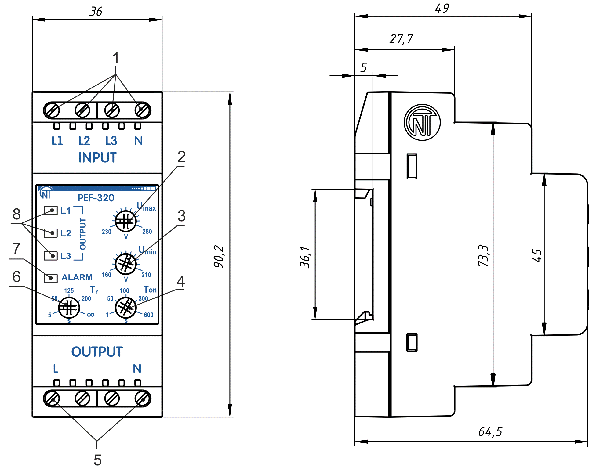
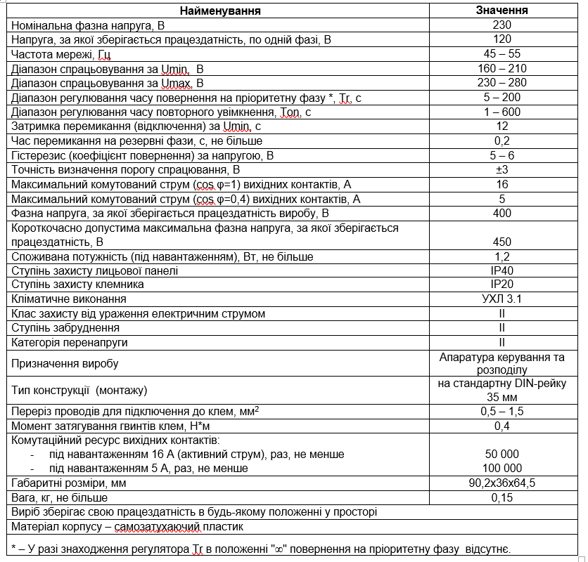
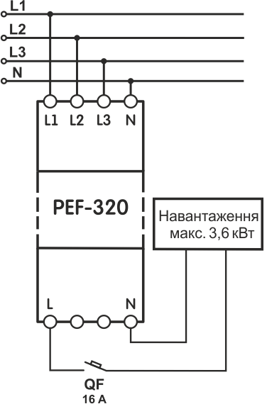

# УНІВЕРСАЛЬНИЙ АВТОМАТИЧНИЙ ЕЛЕКТРОННИЙ ПЕРЕМИКАЧ ФАЗ PEF-320

# КЕРІВНИЦТВО З ЕКСПЛУАТАЦІЇ. ПАСПОРТ

_Система керування якістю розробки та виробництва відповідає вимогам ISO 9001:2015_

**Шановний покупець!**

Підприємство "Новатек-Електро" дякує Вам за придбання нашої продукції. Уважно вивчивши Керівництво з експлуатації, Ви зможете правильно користуватися виробом. Зберігайте Керівництво з експлуатації на протязі всього терміну служби виробу.

**УВАГА! УСІ ВИМОГИ КЕРІВНИЦТВА З ЕКСПЛУАТАЦІЇ ОБОВ'ЯЗКОВІ ДЛЯ ВИКОНАННЯ!**

:warning:**ЗАСТЕРЕЖЕННЯ** – НА КЛЕМАХ ТА ВНУТРІШНІХ ЕЛЕМЕНТАХ ВИРОБУ ПРИСУТНЯ НЕБЕЗПЕЧНА ДЛЯ ЖИТТЯ НАПРУГА. ДЛЯ ЗАБЕЗПЕЧЕННЯ БЕЗПЕЧНОЇ ЕКСПЛУАТАЦІЇ ВИРОБУ **КАТЕГОРИЧНО ЗАБОРОНЯЄТЬСЯ:**

- ВИКОНУВАТИ МОНТАЖНІ РОБОТИ ТА ТЕХНІЧНЕ ОБСЛУГОВУВАННЯ **БЕЗ ВІДКЛЮЧЕННЯ ВИРОБУ ВІЖ МЕРЕЖІ ЖИВЛЕННЯ**;
- САМОСТІЙНО ВІДКРИВАТИ ТА РЕМОНТУВАТИ ВИРІБ;
- ЕКСПЛУАТУВАТИ ВИРІБ ІЗ МЕХАНІЧНИМИ ПОШКОДЖЕННЯМИ КОРПУСУ.

НЕ ДОПУСКАЄТЬСЯ ПОПАДАННЯ ВОДИ НА КЛЕМИ ТА ВНУТРІШНІ ЕЛЕМЕНТИ ВИРОБУ.

Під час експлуатації та технічному обслуговуванні необхідно дотримуватися вимог нормативних документів:

- «Правила технічної експлуатації електроустановок споживачів»,
- «Правила техніки безпеки при експлуатації електроустановок споживачів»,
- «Охорона праці при експлуатації електроустановок».

Підключення, регулювання та технічне обслуговування виробу повинні виконуватися кваліфікованими спеціалістами, що вивчили це Керівництво з експлуатації. За умов дотримання правил експлуатації виріб безпечний для використання. Це Керівництво з експлуатації призначене для ознайомлення з будовою, вимогами з безпеки, порядком експлуатації та обслуговування автоматичного електронного перемикача фаз PEF-320 (далі за текстом виріб, PEF-320).

**Виріб відповідає вимогам:**

- ДСТУ EN 60947-1:2017 Пристрої комплектні розподільчі низьковольтні. Частина 1. Загальні правила;
- ДСТУ EN 60947-6-2:2014 Перемикач і контролер низьковольтні. Частина 6-2. Устаткування багатофункційне. Пристрої перемикання керувальні та захисні;
- ДСТУ EN 55011:2017 Електромагнітна сумісність. Обладнання промислове, наукове та медичне радіочастотне. Характеристики електромагнітних завад. Норми і методи вимірювання;
- ДСТУ EN 61000-4-2:2018 Електромагнітна сумісність. Частина 4-2. Методи випробування та вимірювання. Випробування на несприйнятливість до електростатичних розрядів.

Шкідливі речовини в кількості, що перевищує гранично допустимі концентрації, відсутні.

**Терміни та скорочення:**

- **АПВ** – автоматичне повторне увімкнення;
- **OUTPUT** – клеми для підключення навантаження, а також індикатори, що вказують на підключену до навантаження фазу **(L1, L2, L3)**.
- Термін **«Нормальна напруга»** означає, що значення напруги не виходить за межі порогів, що встановлені Користувачем.

---

## 1 ПРИЗНАЧЕННЯ

**1.1 Призначення виробу**

Універсальний автоматичний електронний перемикач фаз PEF-320 призначений для живлення промислового і побутового однофазного навантаження 230 В 50 Гц від трифазної чотирипровідної мережі (3х400+N) з метою забезпечення безперебійного живлення особливо відповідальних однофаз-них споживачів і захисту їх від неприпустимих коливань напруги в мережі. Залежно від наявності та якості напруги на фазах PEF-320 автоматично здійснює вибір найближчої за пріоритетом фази в межах порогів, заданих Користувачем, і підключає до неї однофазне навантаження. Можливе підключення до однієї з фаз електрогенератора, інвертора. Пороги мінімальної і максимальної напруги задаються Користувачем.

**1.2 Органи керування, габаритні та установчі розміри PEF-320**

Органи керування та габаритні розміри PEF-320 наведені на рисунку 1.

1. клеми для підключення живлення;
2. регулятор установки порогу спрацьовування за максимальною напругою (Umax);
3. регулятор установки порогу спрацьовування за мінімальною напругою (Umin);
4. регулятор установки часу автоматичного повторного увімкнення (Тon);
5. клеми для підключення навантаження;
6. регулятор установки часу повернення на пріоритетну фазу (Тr);
7. індикатор аварії (ALARM);
8. індикатори фаз (L1, L2, L3).

**Рисунок 1** - Органи керування та габаритні розміри

**1.3 Умови експлуатації**

Виріб призначений для експлуатації в наступних умовах:

- температура навколишнього середовища від мінус 35 до +55 ºС;
- атмосферний тиск від 84 до 106,7 кПа;
- відносна вологість повітря (при температурі +25 ºС) 30 … 80%.

_Якщо температура виробу після транспортування (зберігання) відрізняється від температури середовища, при якій передбачається його експлуатація, то перед підключенням до електричної мережі виріб потрібно витримати в умовах передбачуваної експлуатації протягом двох годин (оскільки на елементах виробу можлива конденсація вологи)._

**УВАГА! Виріб не призначений для експлуатації в умовах:**

- значної вібрації та ударів;
- високої вологості;
- агресивного середовища із вмістом у повітрі кислот, лугів тощо, а також сильних забруднень (жир, мастило, пил тощо).

---

## 2 ТЕХНІЧНІ ХАРАКТЕРИСТИКИ

Технічні характеристики PEF-320 наведені в таблиці 1

**Таблиця 1**

---

## 3 БУДОВА ТА ПРИНЦИП РОБОТИ

Електронний перемикач фаз PEF-320 – мікропроцесорний цифровий пристрій. Користувач встановлює пороги спрацьовування PEF-320 – мінімальне та максимальне значення напруги, при якій виріб спрацьовує і перемикає на резервну фазу (відключає навантаження). Світіння одного з зелених світлодіодів L1, L2, L3 на лицьовій панелі вказує фазу, до якої підключене навантаження. PEF-320 має три незалежних вводи, клема L1 (пріоритетна фаза) та L2, L3 (резервні фази). При нормальній напрузі на всіх фазах (L1, L2, L3), навантаження буде підключене до фази L1. Якщо значення напруги L1 виходить за межі порогів спрацьовування, PEF-320 перевіряє фазу L2 та підключає через неї навантаження. Якщо на L2 значення напруги виходить за межі порогів спрацьовування, PEF-320 підключає навантаження до фази L3. Якщо напруга на резервних фазах не відповідає виставленим порогам – навантаження відключається.

**Перемикання на фазу із недопустимими параметрами не здійснюється.** Після переходу на резервну фазу та відновлення параметрів напруги на пріоритетній, навантаження перемкнеться на пріоритетну фазу через час повернення, заданий Користувачем.

**УВАГА! Якщо у разі відліку часу повернення напруги на пріоритетну фазу вийде за межі порогів, тоді лічильник часу перезапуститься.**

Якщо регулятор Тr встановлений в положення “∞”, тоді повернення на пріоритетну фазу відбувається тільки у разі виходу напруги на резервній фазі за межі заданих порогів. У тому випадку, коли напруга, що подається на навантаження, знизиться нижче порогу мінімально допустимої напруги, перемикання або відключення навантаження відбувається із часовою затримкою 12 секунд. Якщо значення напруги перевищить поріг максимально допустимої напруги або ж знизиться на 30 В нижче порогу мінімально допустимої напруги - перемикання або відключення навантаження відбудеться із затримкою 0,2 секунди. У разі відключення навантаження PEF-320 продовжує контроль напруги на всіх фазах. Після відновлення параметрів напруги на одній з фаз в допустимих межах, PEF-320 підключить навантаження до цієї фази після закінчення відліку часу АПВ.

---

## 4 ВИКОРИСТАННЯ ЗА ПРИЗНАЧЕННЯМ

**4.1 Підготовка до використання**  
**4.1.1** Підготовка до підключення:

1. розпакувати виріб та перевірити виріб на відсутність пошкоджень після транспортування, у разі виявлення таких звернутися до постачальника або виробника;
2. уважно вивчити Керівництво з експлуатації (**зверніть особливу увагу на схему підключення живлення виробу**);
3. якщо у Вас виникли питання з монтажу виробу, будь ласка, зверніться до відділу технічної підтримки за телефоном, який вказано у кінці Керівництва з експлуатації.

**4.1.2** Підключення виробу

**УВАГА! ВИРІБ НЕ ПРИЗНАЧЕНИЙ ДЛЯ КОМУТАЦІЇ НАВАНТАЖЕННЯ ПРИ КОРОТКИХ ЗАМКНЕННЯХ. У ЛАНЦЮГУ ВИХІДНИХ КОНТАКТІВ ВИРОБУ НЕОБХІДНО ВСТАНОВИТИ АВТОМАТИЧНИЙ ВИМИКАЧ (ЗАПОБІЖНИК) ЗІ СТРУМОМ ВІДКЛЮЧЕННЯ НЕ БІЛЬШЕ 16 А КЛАСУ B.**

**УВАГА! ВСІ ПІДКЛЮЧЕННЯ ПОВИННІ ВИКОНУВАТИСЯ ПРИ ЗНЕСТРУМЛЕНОМУ ВИРОБІ.**

_Помилка при виконанні монтажних робіт може вивести з ладу виріб та підключені до нього пристрої._

Для забезпечення надійності електричних з'єднань слід використати гнучкі (багатодротяні) проводи з ізоляцією на напругу не менше 450 В, кінці яких необхідно зачистити від ізоляції на 5±0,5 мм і обтиснути втулковими наконечниками. Рекомендується використати провід перерізом не менше 1 мм2. Кріплення проводів повинне виключати механічні ушкодження, скручування і стирання ізоляції проводів.

**НЕ ДОПУСКАЄТЬСЯ ЗАЛИШАТИ ОГОЛЕНІ ДІЛЯНКИ ПРОВОДА, ЩО ВИСТУПАЮТЬ ЗА МЕЖІ КЛЕМНИКА.**

_Для надійного контакту необхідно виконувати затягнення гвинтів клемника із зусиллям, вказаним у таблиці 1._\*\*

При зменшенні моменту затягнення – місце з’єднання нагрівається, може оплавитися клемник та загорітися провід. При збільшенні моменту затягнення – можливий зрив різьби гвинтів клемника або перетискання під’єднаного проводу.

**4.1.2.1** Підключити виріб відповідно до схеми, що вказана на рисунку 2.

**Рисунок 2** – Схема підключення PEF-320

**QF** - автоматичний вимикач на струм не більше 16 А.

**4.1.2.2** Встановити пороги спрацьовування виробу за допомогою регуляторів: Umax, Umin, Тr та Тon.

**УВАГА! Не докладайте надмірних зусиль під час виконання установчих операцій.**

**Umax** – поріг спрацьовування за максимальною напругою.

**Umin** – поріг спрацьовування за мінімальною напругою.

**Тon** – час автоматичного повторного увімкнення навантаження після відновлення параметрів напруги на одній з фаз, а також час первинного увімкнення навантаження після подання напруги на PEF-320. Для холодильників, кондиціонерів та інших компресорних приладів **Тon** рекомендовано встановлю-вати в межах 180 – 600 с, для других приладів – згідно їхніх інструкцій з експлуатації.

**Тr** – час повернення на пріоритетну фазу.

Після виставляння порогових значений виріб готовий до роботи із навантаженням.

**Допускається змінювати порогові значення Umax, Umin, Тr та Тon під час роботи виробу із дотриманням правил техніки безпеки.**

**4.2 Використання за призначенням**
Після підключення до мережі та встановлення параметрів PEF-320 готовий до роботи. Світіння одного з індикаторів **L1**, **L2**, **L3** на лицьовій панелі вказує фазу, до якої підключене навантаження. Якщо відбудеться відключення навантаження від усіх трьох фаз, світиться індикатор **ALARM**. Якщо напруга на всіх трьох фазах не відповідає виставленим порогам спрацьовування – навантаження відключається та спалахує індикатор **ALARM**. В тому випадку, коли в мережі використовується декілька PEF-320, для запобігання перевантаження за фазами в якості пріоритетної рекомендується вибирати різні фази для різних груп споживачів.

---

## 5 ТЕХНІЧНЕ ОБСЛУГОВУВАННЯ

**5.1 Заходи безпеки**

:warning:**НА КЛЕМАХ І ВНУТРІШНІХ ЕЛЕМЕНТАХ ВИРОБУ ПРИСУТНЯ НЕБЕЗПЕЧНА ДЛЯ ЖИТТЯ НАПРУГА. ПРИ ТЕХНІЧНОМУ ОБСЛУГОВУВАННІ НЕОБХІДНО ВІДКЛЮЧИТИ ВИРІБ І ПІДКЛЮЧЕНІ ДО НЬОГО ПРИСТРОЇ ВІД МЕРЕЖІ ЖИВЛЕННЯ.**

**5.2** Технічне обслуговування виробу повинне виконуватися **кваліфікованими спеціалістами**.

**5.3** Рекомендована періодичність технічного обслуговування – **кожні шість місяців**.

**5.4 Порядок технічного обслуговування:**

1. перевірити надійність під’єднання проводів, за необхідності затиснути із зусиллям, вказаним у таблиці 1;
2. візуально перевірити цілісність корпусу, у випадку виявлення тріщин і відколів виріб зняти з експлуатації та відправити на ремонт;
3. за необхідності протерти ганчір’ям лицьову панель та корпус виробу.

**Для чищення не використовуйте абразивні матеріали та розчинники.**

---

## 6 ТЕРМІН СЛУЖБИ ТА ГАРАНТІЇ ВИРОБНИКА

**6.1** Термін служби виробу 10 років. Після закінчення терміну служби звернутися до виробника.

**6.2** Термін зберігання – 3 роки.

**6.3** Гарантійний термін експлуатації виробу складає 10 років з дня продажу. Протягом гарантійного терміну експлуатації (у разі відмови виробу) виробник виконує безкоштовно ремонт виробу.

**УВАГА! ЯКЩО ВИРІБ ЕКСПЛУАТУВАВСЯ З ПОРУШЕННЯМ ВИМОГ ЦЬОГО КЕРІВНИЦТВА З ЕКСПЛУАТАЦІЇ, ПОКУПЕЦЬ ВТРАЧАЄ ПРАВО НА ГАРАНТІЙНЕ ОБСЛУГОВУВАННЯ.**

**6.4** Гарантійне обслуговування здійснюється за місцем придбання або виробником виробу.

**6.5** Післягарантійне обслуговування виробу виконується виробником за діючими тарифами.

**6.6** Перед відправкою на ремонт, виріб повинен бути упакований в заводську або іншу упаковку, яка виключає механічні пошкодження.

_Переконливе прохання: у разі повернення виробу та передачі його на гарантійне (післягарантійне) обслуговування, в полі відомостей про рекламації детально вкажіть причину повернення._

---

## 7 ТРАНСПОРТУВАННЯ ТА ЗБЕРІГАННЯ

Виріб в упаковці виробника допускається транспортувати і зберігати при температурі від мінус 45 до +60 C і відносній вологості не більше 80 %.
