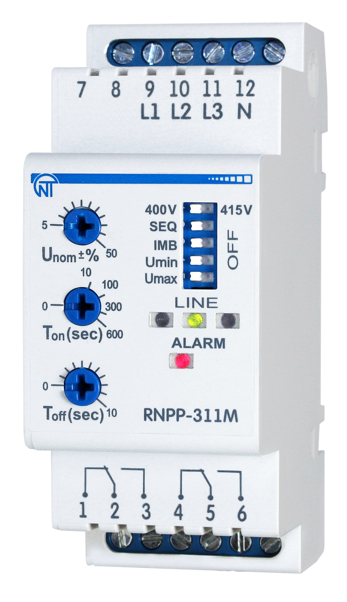
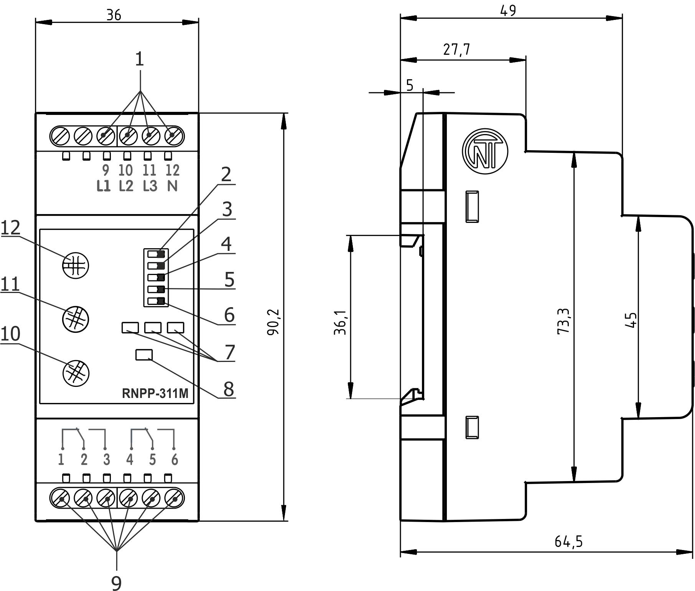
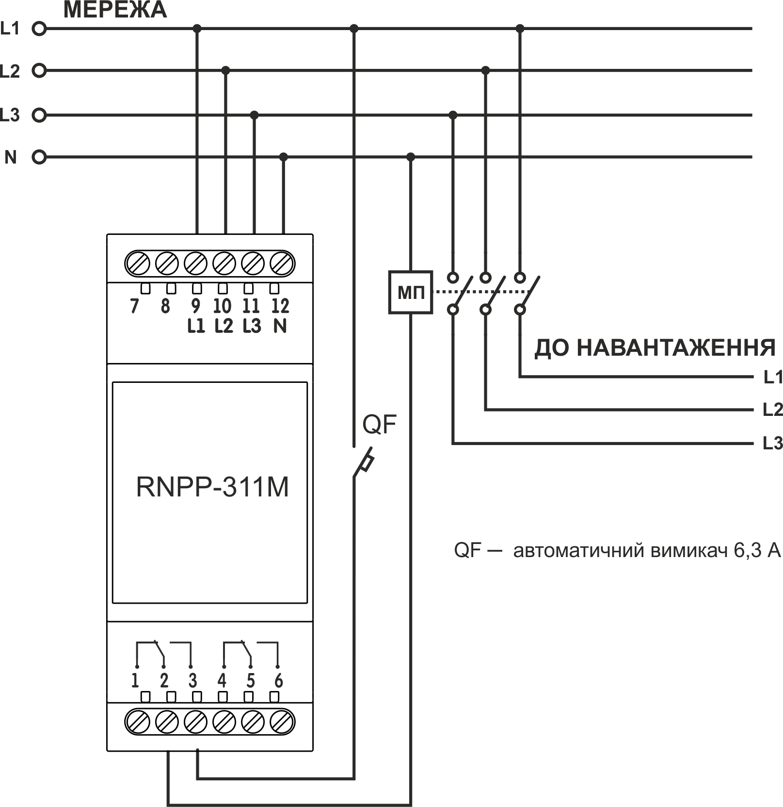
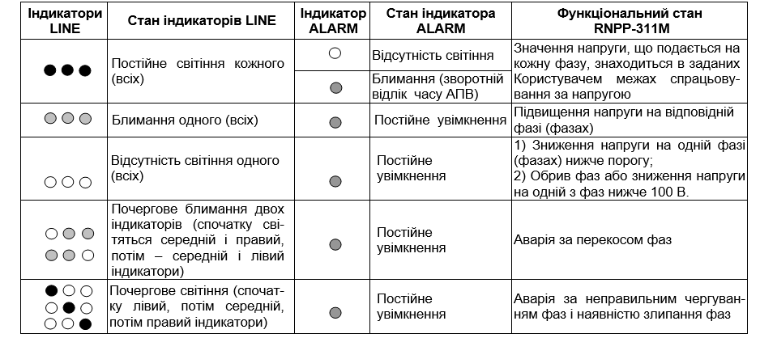

# РЕЛЕ НАПРУГИ, ПЕРЕКОСУ ТА ПОСЛІДОВНОСТІ ФАЗ RNPP-311M. КЕРІВНИЦТВО З ЕКСПЛУАТАЦІЇ ПАСПОРТ

Система управління якістю розробки та виробництва відповідає вимогам ISO 9001:2015

---

**Шановний покупець!**

**Підприємство "Новатек - Електро" дякує Вам за придбання нашої продукції. Уважно вивчивши Керівництво з експлуатації, Ви зможете правильно користуватися виробом. Зберігайте Керівництво з експлуатації на протязі всього терміну служби виробу.**

---

:warning: **УВАГА! ВСІ ВИМОГИ КЕРІВНИЦТВА З ЕКСПЛУАТАЦІЇ ОБОВ’ЯЗКОВІ ДО ВИКОНАННЯ! ЗАСТЕРЕЖЕННЯ** – НА КЛЕМАХ ТА ВНУТРІШНІХ ЕЛЕМЕНТАХ ВИРОБУ **ПРИСУТНЯ НЕБЕЗПЕЧНА ДЛЯ ЖИТТЯ НАПРУГА.**

ДЛЯ ЗАБЕЗПЕЧЕННЯ БЕЗПЕЧНОЇ ЕКСПЛУАТАЦІЇ ВИРОБУ **КАТЕГОРИЧНО ЗАБОРОНЯЄТЬСЯ:**

- ВИКОНУВАТИ МОНТАЖНІ РОБОТИ ТА ТЕХНІЧНЕ ОБСЛУГОВУВАННЯ БЕЗ ВІДКЛЮЧЕННЯ ВИРОБУ ВІД МЕРЕЖІ ЖИВЛЕННЯ;

- САМОСТІЙНО ВІДКРИВАТИ ТА РЕМОНТУВАТИ ВИРІБ;

- ЕКСПЛУАТУВАТИ ВИРІБ З МЕХАНІЧНИМИ ПОШКОДЖЕННЯМИ КОРПУСУ;

НЕ ДОПУСКАЄТЬСЯ ПОПАДАННЯ ВОДИ НА КЛЕМИ І ВНУТРІШНІ ЕЛЕМЕНТИ ВИРОБУ.

**УВАГА! У ЛАНЦЮГУ ВИХІДНИХ КОНТАКТІВ ВИРОБУ МАЄ БУТИ ВСТАНОВЛЕНИЙ АВТОМАТИЧНИЙ ВИМИКАЧ (ЗАПОБІЖНИК) АБО ЙОГО АНАЛОГ НА СТРУМ НЕ БІЛЬШЕ 6,3 А КЛАСУ В.**

**Для підвищення експлуатаційних властивостей виробу рекомендується в ланцюгу живлення RNPP-311M (L1, L2, L3) встановити запобіжник (вставку плавку) на струм 1 А.**

При експлуатації і технічному обслуговуванні необхідно дотримуватись вимог нормативних документів:

- «Правила технічної експлуатації електроустановок споживачів»,
- «Правила техніки безпеки при експлуатації електроустановок споживачів»,
- «Охорона праці при експлуатації електроустановок».

Підключення, регулювання та технічне обслуговування виробу повинні виконуватися кваліфікованими спеціалістами, що вивчили це Керівництво з експлуатації.

За умов дотримання правил експлуатації виріб безпечний для використання.

---

_**Виріб відповідає вимогам:**_

- ДСТУ EN 60947-1:2017 Пристрої комплектні розподільчі низьковольтні. Частина 1. Загальні правила;
- ДСТУ EN 60947-6-2:2014 Перемикач і контролер низьковольтні. Частина 6-2. Устаткування багатофункційне. Пристрої перемикання керувальні та захисні;
- ДСТУ EN 55011:2017 Електромагнітна сумісність. Обладнання промислове, наукове та медичне радіочастотне. Характеристики електромагнітних завад. Норми і методи вимірювання;
- ДСТУ EN 61000-4-2:2018 Електромагнітна сумісність. Частина 4-2. Методи випробування та вимірювання. Випробування на несприйнятливість до електростатичних розрядів.

Шкідливі речовини у кількості, що перевищує гранично допустимі концентрації, відсутні.

**Терміни і скорочення:**

**АПВ** – автоматичне повторне увімкнення;

**МП** – магнітний пускач.

Термін **«Нормальна напруга»** означає, що значення напруги не виходить за межі порогів, встановлених Користувачем.

---

Це Керівництво з експлуатації призначене для ознайомлення з будовою, вимогами з безпеки, порядком експлуатації та обслуговування Реле напруги, перекосу ті послідовності фаз RNPP-311M (далі за текстом виріб, RNPP-311M).

## 1 ПРИЗНАЧЕННЯ

**1.1 Призначення виробу**

RNPP-311M призначене:

- для контролю допустимого рівня напруги;
- для контролю правильного чергування і відсутності злипання фаз;
- для контролю повнофазності і симетричності напруги мережі (перекосу фаз);
- для вимкнення навантаження при неякісній напрузі мережі;
- для контролю напруги мережі після вимкнення навантаження і автоматичного увімкнення її після відновлення параметрів напруги;
- для відображення аварії при виникненні аварійної ситуації і відображення наявності напруги на кожній фазі.

RNPP-311M здійснює контроль нуля непрямим методом.

У виробі передбачені можливості регулювання параметрів (порогу спрацьовування за напругою, часу АПВ і часу затримки спрацьовування захисту), вибору напруги мережі, що контролюється (400 В або 415 В) і набору захисних функцій.

Після відновлення параметрів напруги мережі виріб знову вмикає навантаження через час АПВ.

**Примітка – Для мереж із великим рівнем гармонік рекомендуємо використовувати модифікацію виробу RNPP-311M-24 із підключенням автономного джерела живлення 24 В.**

**1.2 Органи керування, габаритні та установчі розміри RNPP-311M**

Органи керування, габаритні та установчі розміри RNPP-311M наведені на рисунку 1.

**Рисунок 1** – Органи керування, габаритні та установчі розміри RNPP-311M

1. вхідні контакти 400 B / 415 B;
2. перемикач напруги контрольованої мережі **(400 V / 415 V)**;
3. перемикач спрацьовування захисту за чергуванням фаз **(SEQ)** (в положенні «OFF» - захист вимкнено);
4. перемикач спрацьовування захисту за перекосом фаз **(IMB)** (в положенні «OFF» - захист вимкнено);
5. перемикач спрацьовування захисту за мінімальною напругою **(Umin)** (в положенні «OFF» - захист вимкнено);
6. перемикач спрацьовування захисту за максимальною напругою **(Umax)** (в положенні «OFF» - захист вимкнено);
7. індикатори наявності напруги на кожній фазі **(LINE)**;
8. індикатор аварії та вимкненого стану реле навантаження **(ALARM)**;
9. вихідні контакти виробу;
10. регулятор установки часу спрацьовування захисту **(Тoff(sec))**;
11. регулятор установки часу АПВ **(Ton(sec))**;
12. регулятор установки порогу спрацьовування за максимальною / мінімальною напругою **(Unom±%)**.

**1.3 Умови експлуатації**

Виріб призначений для експлуатації в наступних умовах:

- температура навколишнього середовища від мінус 35 до +55 ºС;
- атмосферний тиск від 84 до 106,7 кПа;
- відносна вологість повітря (при температурі +25 ºС) 30 … 80%.

_Якщо температура виробу після транспортування (зберігання) відрізняється від температури середовища, при якій передбачається його експлуатація, то перед підключенням до електричної мережі виріб потрібно витримати в умовах передбачуваної експлуатації протягом двох годин (оскільки на елементах виробу можлива конденсація вологи)._

**УВАГА! Виріб не призначений для експлуатації в умовах:**

- значної вібрації та ударів;
- високої вологості;
- агресивного середовища із вмістом у повітрі кислот, лугів і т.д., а також сильних забруднень (жир, мастило, пил, тощо).

## 2 ТЕХНІЧНІ ХАРАКТЕРИСТИКИ

Основні технічні характеристики виробу наведені в таблиці 1.

**Таблиця 1** – Основні технічні характеристики

| Найменування                                                                                                                                           | Значення                        |
| ------------------------------------------------------------------------------------------------------------------------------------------------------ | ------------------------------- |
| Номінальна лінійна / фазна напруга живлення мережі, В                                                                                                  | 400 / 230, 415 / 240            |
| Частота мережі, Гц                                                                                                                                     | 45 – 65                         |
| Гармонійний склад (несинусоїдність) напруги живлення                                                                                                   | 1ДСТУ EN 50160:2014             |
| Діапазон регулювання порогу спрацьовування за максимальною / мінімальною напругою живлення, у відсотках від номінальної напруги                        | 5 – 50                          |
| Діапазон регулювання часу спрацьовування захисту, с                                                                                                    | 0 – 10                          |
| Діапазон регулювання часу АПВ, с                                                                                                                       | 0 – 600                         |
| Фіксована затримка спрацьовування за мінімальною напругою, с                                                                                           | 12\*                            |
| Час спрацьовування при обриві однієї з фаз, с, не більше                                                                                               | 0,2                             |
| Час готовності під час подання напруги живлення, с, не більше                                                                                          | 0,2\*\*                         |
| Величина визначення перекосу фаз, В                                                                                                                    | 60                              |
| Гістерезис за напругою, В                                                                                                                              | 5 - 6                           |
| Гістерезис за перекосом фаз, В                                                                                                                         | 5 - 6                           |
| Точність визначення порогу спрацьовування за напругою, В, не більше                                                                                    | 3                               |
| Точність визначення перекосу фаз, %, не більше                                                                                                         | 2                               |
| Напруга, за якої зберігається працездатність: - за однією фазою, В - за трьома фазами, В                                                         |  140-450  90-450          |
| Споживана потужність (під навантаженням), Вт, не більше                                                                                                | 1,2                             |
| Максимальний комутуючий струм вихідних контактів, А                                                                                                    | 5                               |
| Комутуючий ресурс вихідних контактів: - під навантаженням 5 А (cos φ = 1,0), раз, не менше  - під навантаженням 1 А (cos φ = 1,0), раз, не менше |  100 тис.  1 млн.         |
| Призначення виробу                                                                                                                                     | Апаратура керування і розподілу |
| Номінальний режим роботи                                                                                                                               | Тривалий                        |
| Ступінь захисту лицьової панелі                                                                                                                        | IP 40                           |
| Ступінь захисту клемника                                                                                                                               | IP 20                           |
| Клас захисту від ураження електричним струмом                                                                                                          | II                              |
| Кліматичне виконання                                                                                                                                   | УХЛ 3.1                         |
| Допустима ступінь забруднення                                                                                                                          | II                              |
| Категорія перенапруження                                                                                                                               | II                              |
| Номінальна напруга ізоляції, В                                                                                                                         | 450                             |
| Номінальна імпульсна витримана напруга, кВ                                                                                                             | 2,5                             |
| Переріз проводів для підключення до клем, мм²                                                                                                          | 0,5 - 1,5                       |
| Момент затягнення гвинтів клем, Н\*м                                                                                                                   | 0,4                             |
| Маса, кг, не більше                                                                                                                                    | 0,100                           |
| Габаритні розміри (рис.1), H\*B\*L, мм                                                                                                                 | 90,2\*36\*64,5                  |

Установка (монтаж) виробу – стандартна DIN-рейка 35 мм

Виріб зберігає свою працездатність у будь-якому положенні в просторі

Матеріал корпусу – самозатухаючий пластик

**Примітки:**

\* - якщо перемикач **Umin** знаходиться в положенні «Увімкнено», фіксований час спрацьовування виробу становитиме 12 с.

\*\* - під час роботи в режимі «Контроль максимальної напруги» час готовності складає 0,3 с

## 3 ВИКОРИСТАННЯ ЗА ПРИЗНАЧЕННЯМ

**3.1 Підготовка до використання**

**3.1.1** Підготовка до підключення:

- розпакувати та перевірити виріб на відсутність пошкоджень після транспортування, у разі виявлення таких звернутися до постачальника або виробника;
- уважно вивчити Керівництво з експлуатації (зверніть особливу увагу на схему підключення живлення виробу);
- якщо у Вас виникли питання з монтажу виробу, будь ласка, зверніться до відділу технічної підтримки за телефоном, що вказаний у кінці Керівництва з експлуатації.

**3.1.2 Підключення виробу**

**УВАГА! ВСІ ПІДКЛЮЧЕННЯ ПОВИННІ ВИКОНУВАТИСЯ ПРИ ЗНЕСТРУМЛЕНОМУ ВИРОБІ.**

_Помилка при виконанні монтажних робіт може вивести з ладу виріб та підключені до нього пристрої._

Для забезпечення надійності електричних з'єднань слід використати гнучкі (багатодротяні) проводи з ізоляцією на напругу не менше 450 В, кінці яких необхідно зачистити від ізоляції на 5±0,5 мм і обтиснути втулковими наконечниками. Рекомендується використати провід перерізом не менше 1 мм2. Кріплення проводів повинне виключати механічні ушкодження, скручування і стирання ізоляції проводів.

**НЕ ДОПУСКАЄТЬСЯ ЗАЛИШАТИ ОГОЛЕНІ ДІЛЯНКИ ПРОВОДА, ЩО ВИСТУПАЮТЬ ЗА МЕЖІ КЛЕМНИКА.**

**Для надійного контакту необхідно виконувати затягнення гвинтів клемника із зусиллям, вказаним у таблиці 1.**

При зменшенні моменту затягнення – місце з’єднання нагрівається, може оплавитися клемник та загорітися провід. При збільшенні моменту затягнення – можливий зрив різьби гвинтів клемника або перетискання під’єднаного проводу.

**Рисунок 2** – Схема підключення RNPP-311M

**3.1.2.1** Підключіть виріб згідно схемі, що вказана на рисунку 2.

**3.1.2.2** Регулятором **Unom±%** (поз.12 рис. 1) встановити необхідний поріг спрацьовування за максимальною і мінімальною напругою у відсотках від номінальної напруги живлення мережі.

**Увага! Під час установки нижнього порогу за Umin повинна враховуватися напруга відпускання МП.**

**3.1.2.3** Регулятором **Toff (sec)** (поз.10 рис. 1) встановити час спрацьовування захисту за максимальною напругою та за перекосом фаз.

**3.1.2.4** Регулятором **Ton(sec)** (поз.11 рис. 1) встановити час АПВ.

Ton(sec) – час автоматичного повтор-ного увімкнення після спрацьовування виробу і відновлення параметрів напруги мережі; час увімкнення після подання на виріб нормальної напруги.

Час АПВ рекомендується встановлю-вати для кондиціонерів, холодильників і інших компресорних приладів не менше 180 – 240 секунд.

**УВАГА! Не докладайте надмірних зусиль при виконанні установчих операцій.**

**3.1.2.5** Перемикачами спрацьовування захисту (поз.3 – 6 рис. 1) увімкнути необхідні захисти.

**3.1.2.6** Перемикачем **400 V/415 V** (поз. 2 рис. 1) встановити тип мережі, що використовується.

**3.1.2.7** Подати напругу живлення на клеми виробу.

**Примітки:**

1. Якщо при першому увімкненні RNPP-311M відображує аварію за чергуванням фаз, а Користувачеві заздалегідь відомо, що в мережі правильне чергування фаз, необхідно поміняти місцями проводи, що під’єднані до клем **10** і **11**.
2. Якщо виріб планується використовувати в режимі «Контроль максимальної напруги» (п. 3.2.1.3), розрив живлення котушки МП необхідно під’єднати до клем 1-2 (4-5) (зворотна логіка увімкнення). Перемикач **Umax** (поз.6 рис. 1) перемістити в положення «Увімкнено», а перемикачі **SEQ, IMB, Umin** – в положення «OFF».

**3.2 Використання виробу**

**3.2.1** RNPP-311M працює в різних режимах:

- Контроль мінімальної / максимальної напруги;
- Контроль мінімальної напруги;
- Контроль максимальної напруги;
- Контроль наявності фаз;
- Контроль неправильного чергування і наявності злипання фаз; – Контроль перекосу фаз.

**Примітки:**

1. Контроль наявності фаз зберігається в будь-якому режимі роботи;
2. В усіх режимах роботи, окрім режиму «Контроль максимальної напруги», виріб спрацьовує при обриві фаз або зниженні напруги нижче 100 B на одній або декількох фазах за фіксований час 0,2 с.

**3.2.1.1** В режимі «Контроль мінімальної / максимальної напруги» при виході значення напруги мережі за задані Користувачем пороги, захищуване обладнання буде від’єднано від мережі, на лицьовій панелі виробу спалахне індикатор **ALARM**.

**3.2.1.2** В режимі «Контроль мінімальної напруги» при зниженні напруги мережі нижче заданого Користувачем порогу, захищуване обладнання буде від’єднано від мережі, на лицьовій панелі виробу спалахне індикатор **ALARM**.

**3.2.1.3** В режимі «Контроль максимальної напруги», коли напруга мережі підвищиться вище заданого Користувачем порогу, захищуване обладнання буде від’єднано від мережі, на лицьовій панелі виробу спалахне індикатор **ALARM**.

**3.2.1.4** В режимі «Контроль наявності фаз» у разі обриву однієї з фаз, гасне один з індикаторів **LINE**, захищуване обладнання буде від’єднано від мережі, на лицьовій панелі виробу спалахне індикатор **ALARM**.

**3.2.1.5** В режимі «Контроль неправильного чергування і наявності злипання фаз» у разі неправильного підключення або наявності злипання однієї з фаз, на лицьовій панелі виробу по черзі спалахне один з індикаторів **LINE**, спалахне індикатор **ALARM** і захищуване обладнання буде від’єднано від мережі.

**3.2.1.6** В режимі «Контроль перекосу фаз» при перекосі фаз на лицьовій панелі виробу по черзі блимають два індикатора **LINE**, спалахне індикатор **ALARM** і захищуване обладнання буде від’єднано від мережі.

**3.2.2** Виріб на виході має дві групи незалежних вихідних перекидних контактів (1-2-3, 4-5-6). Якщо напруга живлення виробу відключена, контакти 1-2 (4-5) замкнені, а контакти 2-3 (5-6) розімкнені.

Коли реле навантаження спрацьовує, вимкнення навантаження відбувається шляхом розриву ланцюга живлення котушки МП через контакти 2-3 (5-6), _за винятком режиму «Контроль максимальної напруги», в якому виріб працює із зворотною логікою увімкнення._

**3.2.3** Після подання живлення на клеми виробу спалахують індикатори **LINE**. Виріб переходить до стану витримки часу АПВ (задається регулятором **Ton(sec)**), при цьому блимає індикатор **ALARM**. Після закінчення відліку часу АПВ індикатор **ALARM** гасне і RNPP-311M під’єднує захищуване обладнання до мережі. У разі виникнення аварії відлік часу АПВ починається відразу після спрацьовування реле навантаження.

**3.2.4** Якщо виріб використовується в режимі «Контроль максимальної напруги», при нормальній напрузі в мережі, реле навантаження вимкнене (контакти 1-2 (4-5) замкнені, а контакти 2-3 (5-6) розімкнені). Це зроблено для того, щоб виріб у режимі «Контроль максимальної напруги» ніколи не спрацював за зниженням напруги.

У цьому режимі під час першого увімкнення виробу в мережу значення часу АПВ (**Ton(sec)**) не враховується.

**УВАГА! Цей режим не рекомендовано використовувати із навантаженнями типу: двигуни, компре-сори, трифазні трансформатори тощо.**

**3.2.5** Варіанти стану індикаторів **LINE** і **ALARM** приведені в таблиці 2.

**Таблиця 2** – Варіанти стану індикаторів **LINE** і **ALARM**

**Примітка** – Аварія відображується в порядку пріоритету:

1. обрив фаз або зниження напруги нижче 100 В (найбільший пріоритет);
2. чергування фаз;
3. мінімальна і максимальна напруга;
4. перекіс фаз.

**3.3 Приклади використання RNPP-311M**

**3.3.1** RNPP-311M в режимі «Контроль мінімальної напруги»:

- перемикач **Umin** знаходиться в положенні «Увімкнено»;
- перемикачі **IMB, Umax** знаходяться в положенні «OFF».

Якщо аварія виникла за Umin, виріб спрацює через встановлений Користувачем час **Toff (sec)**, спалахне червоний індикатор **ALARM**, згасне відповідний індикатор (індикатори) **LINE**. Коли напруга знижується нижче 100 В виріб спрацьовує через 0,2 с.

**3.3.2** RNPP-311M в режимах «Контроль мінімальної / максимальної напруги» і «Контроль наявності фаз»

Перемикачі **Umin** і **Umax** знаходяться в положенні «Увімкнено». RNPP-311M спрацьовує коли напруга підвищується вище встановленого порогу через час Toff (sec), а при зниженні – з фіксованою затримкою 12 с (відстроювання від пускових просадок), спалахне червоний індикатор **ALARM**. При обриві фаз виріб спрацює через час 0,2 с.

**3.3.3** RNPP-311M в режимі «Контроль максимальної напруги»:

- перемикач **Umax** знаходиться в положенні «Увімкнено»;
- перемикачі **SEQ,** **IMB,** **Umin** знаходяться в положенні «OFF», індикатор **ALARM** не світиться.

Якщо виникла аварія за Umax, виріб спрацює через (Toff (sec) + 0,4) с, спалахне червоний індикатор **ALARM.**

**3.3.4** Час із затримкою на увімкнення Перемикачі **Umin** і **Umax** знаходяться в положенні «OFF».

Реле навантаження увімкнеться після відліку часу АПВ, встановленого Користувачем за допомогою регулятора **Ton(sec).** У всіх режимах роботи увімкнення / вимкнення захисту за порушенням порядку чергування фаз здійснюється перемикачем **SEQ,** а увімкнення / вимкнення захисту за перекосом фаз – перемикачем **IMB.** У разі обриву фаз або зниженні напруги нижче 100 В на одній або більше фазах, виріб спрацює (вимкнеться), індикатор відповідної фази згасне.

Якщо перемикачі **Umin,** **Umax,** **SEQ,** **IMB** знаходяться в положенні «Увімкнено» і аварія виникла за Umin – виріб спрацює з фіксованою затримкою 12 секунд (відстроювання від пускових просадок).

## 4 ТЕХНІЧНЕ ОБСЛУГОВУВАННЯ

**4.1 Заходи безпеки**

:warning:**НА КЛЕМАХ І ВНУТРІШНІХ ЕЛЕМЕНТАХ ВИРОБУ ПРИСУТНЯ НЕБЕЗПЕЧНА ДЛЯ ЖИТТЯ НАПРУГА.**

**ПРИ ТЕХНІЧНОМУ ОБСЛУГОВУВАННІ НЕОБХІДНО ВІДКЛЮЧИТИ ВИРІБ І ПІДКЛЮЧЕНІ ДО НЬОГО ПРИСТРОЇ ВІД МЕРЕЖІ ЖИВЛЕННЯ.**

**4.2** Технічне обслуговування виробу повинне виконуватися **кваліфікованими спеціалістами.**

**4.3** Рекомендована періодичність технічного обслуговування – **кожні шість місяців.**

**4.4 Порядок технічного обслуговування:**

1. перевірити надійність під’єднання проводів, за необхідності затиснути із зусиллям, вказаним у таблиці 1;
2. візуально перевірити цілісність корпусу, у випадку виявлення тріщин і відколів виріб зняти з експлуатації та відправити на ремонт.
3. за необхідності протерти ганчір’ям лицьову панель та корпус виробу.

**Для чищення не використовуйте абразивні матеріали та розчинники.**

**4.5** У разі виявлення несправності виробу потрібно відключити живлення та перевірити правильність підключення. Якщо виявити несправність не вдалося, необхідно зняти виріб з експлуатації та звернутися до виробника.

## 5 ТЕРМІН СЛУЖБИ ТА ГАРАНТІЇ ВИРОБНИКА

**5.1** Термін служби виробу 10 років. Після закінчення терміну служби звернутися до виробника.

**5.2** Термін зберігання – 3 роки.

**5.3** Гарантійний термін експлуатації виробу складає 10 років з дня продажу.

Протягом гарантійного терміну експлуатації (у разі відмови виробу) виробник виконує безкоштовно ремонт виробу.

**УВАГА! ЯКЩО ВИРІБ ЕКСПЛУАТУВАВСЯ З ПОРУШЕННЯМ ВИМОГ ЦЬОГО КЕРІВНИЦТВА З ЕКСПЛУАТАЦІЇ, ПОКУПЕЦЬ ВТРАЧАЄ ПРАВО НА ГАРАНТІЙНЕ ОБСЛУГОВУВАННЯ.**

**5.4** Гарантійне обслуговування здійснюється за місцем придбання або виробником виробу.

**5.5** Післягарантійне обслуговування виробу виконується виробником за діючими тарифами.

**5.6** Перед відправкою на ремонт, виріб повинен бути упакований в заводську або іншу упаковку, яка виключає механічні пошкодження.

## 6 ТРАНСПОРТУВАННЯ ТА ЗБЕРІГАННЯ

Виріб в упаковці виробника допускається транспортувати і зберігати при температурі від мінус 45 до +60 C і відносній вологості не більше 80 %.
